  

# Mở đầu  

Đây là kì CTF chơi dài và try hard liên tục nhất từ trước đến giờ của mình. Hôm nào cũng từ sáng đến tối 🙂🙂🙂 Lại đúng đợt nghỉ dịch nên có nhiều thời gian. Đồng thời, động lực mạnh mẽ là đua top với một số team VN như `efiens`, `ISITDTU`, ... Nhưng trong suốt quá trình thi, chưa lần nào tụi mình vượt được `efiens` mặc dù có những lúc rất gần 😭😭😭   
Cuối cùng, team mình xếp thứ `26` :  

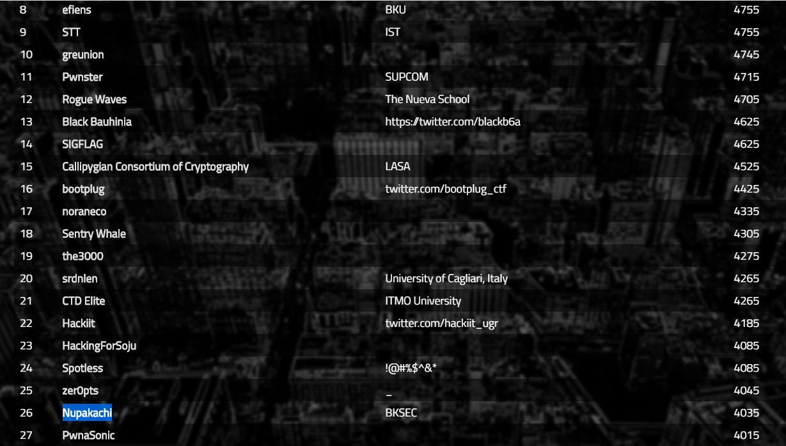  

May mắn vẫn trong một khung ảnh với `efiens`. Đây là thứ hạng khá cao trong kì CTF mà bọn mình từng đạt được. Trong kì này mình cũng làm một bài khó hơn trình mình với some help từ tiền bối. Reverse của giải này cũng khá hay, nó có một số kiến thức về tự động quá trình reverse mà mình đã học được từ trước. 😁😁😁😁 Nice CTF. Nice experiments.  

# Table of contents  

+ [**Crypto**](#wu1)
+ [**Binary**](#wu2)
+ [**Reverse**](#wu3)  


<a name="wu1"></a>
# Crypto  

## Discrete Log  

Bài này đơn giản chỉ là việc tính được a^^x (mod p).  
Dựa vào phi euler được thực thi trong sage.  

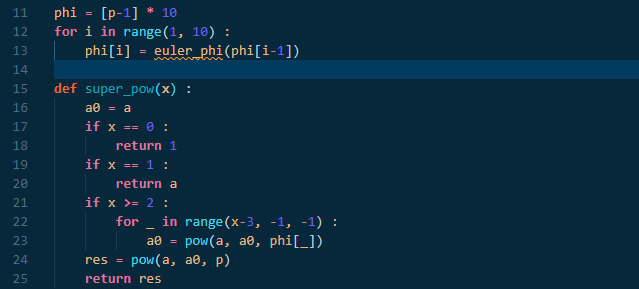  

## RSA-OTP  

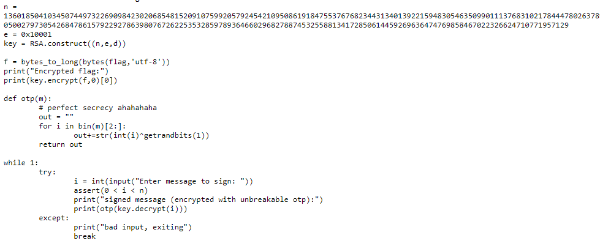  

Ta được cho một đoạn mã được mã hóa bằng RSA với key có độ dài 1024 bit thường là không break được.  
Đồng thời chúng ta cũng có một oracle giải mã cho phép trả về đoạn giải mã RSA của bất kì message nào tuy nhiên lại bị mã hóa bằng One-time-pad.  
Tức qua oracle chúng ta không thể thu được bất kì thông tin gì về ý nghĩa đoạn plaintext được. Nó dùng hàm `random` của thư viện `crypto` nên cũng loại trừ khả năng break hàm random.  

Sau đó mình thử mã hóa một số dữ liệu đặc biệt như : `1`, `n-1`, ...  Thì nhận ra là với `n-1`, khi tiến hành giải mã nó sẽ là `1` nếu d chẵn, `n-1` với d lẻ. Và do độ dài khác nhau vô cùng nên ta có thể dễ dàng phân biệt được `1`, `n-1` để suy ra d lẻ, chẵn.   
Tiếp theo, nỗ lực của mình là recovery từng bit của d theo kiểu mình sẽ đi giải mã lần lượt `x = (n-1) ^ (1/2**k)`. Nhưng điều đó đồng nghĩa với việc đi giải phương trình trên. Một công việc chỉ thực hiện được khi phân tích được n thành các số nguyên tố 🙄🙄🙄Hopeless ....   

Những nỗ lực tiếp theo, mình nhận ra oracle-otp-rsa cho chúng ta thông tin về độ dài các bit. Lại có nhận xét rằng, nếu `lenbit(m) == lenbit(n)` thì `lenbit(2*m % n) <= lenbit(m)`, ngược lại, `lenbit(m) < lenbit(n)` thì `lenbit(2*m % n) > lenbit(m)`.   
Điều đó có nghĩa là :  
 + nếu `lenbit(2*m % n) > lenbit(m)` thì m < n/2
 + nếu `lenbit(2*m % n) <= lenbit(m)` thì m >= n/2  

Điều trên khá là giống với những gì ta thu được từ một oracle quen thuộc : `LSB oracle`.   
 + Bước 1 : Ta giải mã c và thu được số bit của m
 + Bước 2 : Tiến hành giải mã 2** e*c. Nếu số bit thu được lớn hơn bước 1 thì :  
   + m < n/2
   + Ngược lại, m >= n/2 
 + Bước 3 : hiện tại ta thu được `lower < m < upper`. Tiếp tục tiến hành giải mã 2** 2e * c, ta thu được 4 * m. Nếu số bit thu được tại bước này lớn hơn số bit thu được tại bước trước thì :  
   + `lower = (lower + upper) / 2`
   + Ngược lại, `upper = (lower + upper) / 2` 
 + Lặp lại cho tới khi `upper - lower <=2`
Nếu muốn hiểu thêm, có thể tham khảo thêm tại : [stackexchange](https://crypto.stackexchange.com/questions/11053/rsa-least-significant-bit-oracle-attack)  


<a name="wu2"></a>
# Binary  

## No canary   

Canary là một cơ chế bảo mật để ngăn lỗi tràn bộ đệm. Chúng ta có thể kiểm tra các cơ chế bảo mật của một file bằng lệnh `checksec` trong linux.  

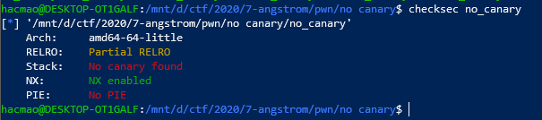  

Như ta thấy, không có canary ở đây.  
Phân tích binary :   

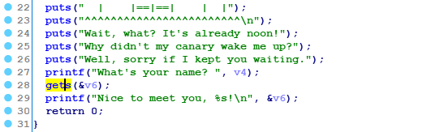  

Hàm `gets` là một hàm để nhập vào một string nhưng không check độ dài nhập vào.  

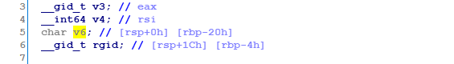  

Như vậy, ta có một lỗi tràn bộ đệm ở đây. Với lỗi này, ta có thể kiểm soát địa chỉ trở về của hàm main, từ đó thay đổi luồng thực thi của chương trình.  
Vậy thay đổi đi đâu ?   

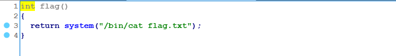  

Chúng ta có hàm in ra flag -> đích đến cần redirect.   

## Canary  

Khác với lần trước, lần này binary đã có cơ chế bảo mật để ngăn lỗi tràn :  

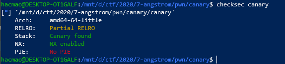  

Hàm chính :  

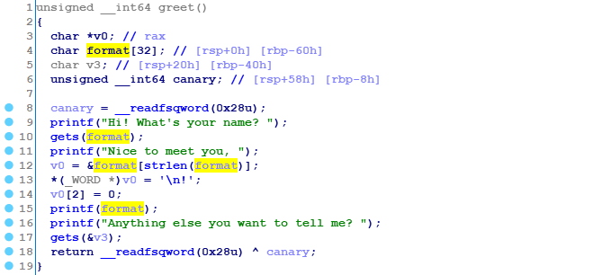  

Canary là một tham số được sinh ngẫu nhiên mỗi lần thực thi chương trình, được đặt ở giữa biến của hàm và địa chỉ trở về của hàm. Vì vậy khi ta có một lỗi tràn từ biến cục bộ, muốn tới được địa chỉ trở về thì cần phải ghi đè qua `canary`. Khi đó, sau khi kết thúc hàm, chương trình sẽ thực hiện check canary bằng phép toán `xor` với canary được lưu tại vùng khác. Nếu phát hiện thay đổi, chương trình sẽ lập tức kết thúc và trả lại lỗi : `stack smash detected`.  

Chúng ta có thể bypass được canary nếu leak được nó bằng các hàm khác trong chương trình.  
Trong hàm này, ngoài lỗi `overflow` , còn có lỗi rất phổ biến là `format string`.  
Với lỗi này, ta có thể thực hiện in ra địa chỉ nhờ `%x`, `%p`, đọc giá trị tại một địa chỉ bằng `%s`, ghi giá trị bằng `%n`.  
Do bài này có lỗi tràn, ta chỉ cần leak canary nên chỉ cần dùng `%x`.Ta có thể dùng `%$i\$x` để in ra giá trị tại một vị trí xác định trên stack.  

Viết script để automatic quá trình này :   

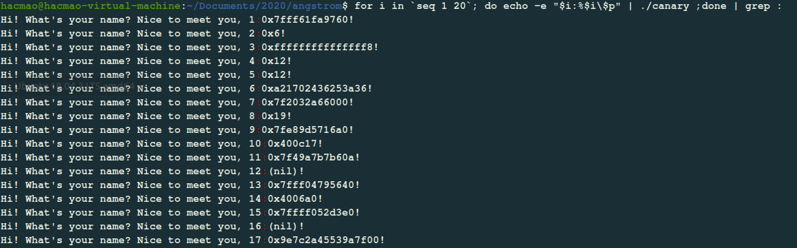  

Canary là một số 64 bit thường sẽ không có bắt đầu bằng `0x7f` , kết thúc bằng `\x00`. Như vậy, `%17$x` sẽ in ra được giá trị của canary.   
Thực hiện tràn thôi 😁😁😁   

## Bop It  

Bỏ qua râu ria :vvv Vào thẳng hàm chính.  

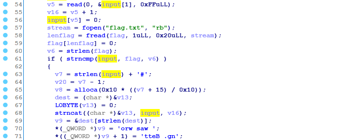  

Chương trình không có những lỗi tràn về địa chỉ trở về hay format string nữa. Sẽ rất khó khăn để chiếm được shell nhưng mục tiêu của chúng ta chỉ cần có được flag. 🤗🤗🤗 Và flag của bài này thì được đọc từ file và được đặt ngay trong stack. Có hàm in ra luôn. Vậy chỉ cần in ra thôi ( •̀ ω •́ )✧   

Điểm đặc biệt ở đây là với từng input nhập vào, stack lại được mở rộng ra theo độ lớn của string ta nhập vào. Mà IDA đã tối ưu nó và đặt tên là `alloca`.  
Nhưng độ lớn của string lại được điều chỉnh bằng hàm `strlen`. Chúng ta có thể dể dàng trigger nó bằng cách nhập vào `\x00`. Từ đó ta có thể tràn đủ kí tự tới đoạn lưu flag rồi in ra thôi.  

## LIbrary C  

Đây là một dạng bài khá kinh điển khi tấn công bằng lỗi `format string`.  

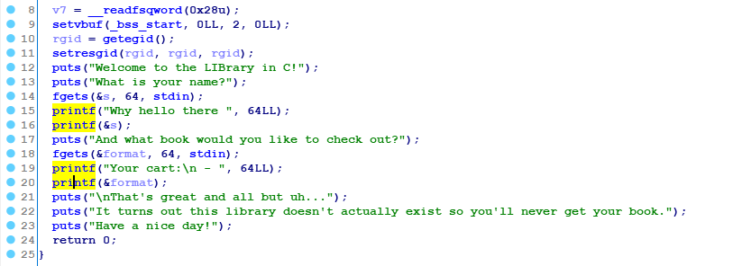  

Chúng ta có hai lần `format string` :  
 + lần 1 : tiến hành leak libc 
 + lần 2 : tiến hành ghi đè địa chỉ GOT của puts -> one_gadget  

Làm format string rất mệt ở chỗ sắp xếp tham số sao cho đúng. 😥😥 So time consuming on that.  

## BookFace  

Bài này được sự support idea của lãnh đạo, mà mình mới ngộ ra được chân lý.Lúc đầu không nhận ra lỗi gì cả 😌😌😌  

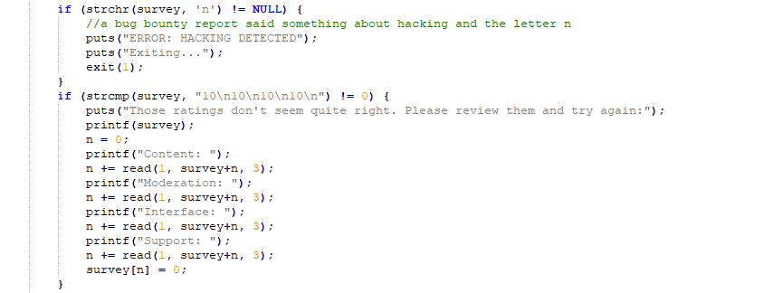

Đầu tiên là lỗi format string khá dễ dàng nhận ra. Nhưng nó filter `n` nên ta chỉ có thể leak được địa chỉ hàm các kiểu mà không có cách nào để thay đổi luồng thực thi của chương trình.  


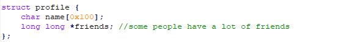 

Lỗi thứ hai khó phát hiện hơn. Hoặc là do mình hơi confuse về con trỏ trong C nên không nhận ra.  
`Friend` là con trỏ. Nhưng khi `make` hoặc `lost` friends thì nó lại cộng hoặc trừ vào con trỏ chứ không phải giá trị tại con trỏ.  

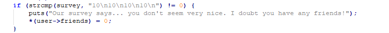  

Sau đó chúng ta lại có thể ghi giá trị 0 vào con trỏ tại pointers.  
Hmm từ đó có thể ghi giá trị 0 vào bất kì địa chỉ nào 🤔🤔🤔   
What's a suprise.  
Sau đó lại được hint tiếp về ghi đè lên `stdin` vtable gì đó. Lại đi tìm hiểu thêm về file exploit. Có một slide khá hay về nó của angel boy : [đây](https://www.slideshare.net/AngelBoy1/play-with-file-structure-yet-another-binary-exploit-technique)  

Idea là sẽ ghi đè lên vtable của hàm stdin. Do các hàm vào ra của chương trình C khi thực thi sẽ gọi một số hàm trong `vtable`. Do đó nếu ta fake được vtable thì ta có thể kiểm soát được gọi hàm nào.  

Dựa vào lỗi ở trên và lỗi leak , ta có thể ghi đè giá trị 0 vào `stdin->vtable`.  

Tiếp đến, ta cần thiết lập vùng nhớ tại địa chỉ `0x0` là fake vtable.  

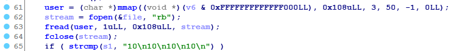  

Chúng ta được quyền `mmap` tại một vùng nhớ random như này. Hmm nếu để nó random một cách tự nhiên thì theo mình test sẽ cần tới `> 100000` vòng lặp nó mới cho ra một giá trị < 0x1000. Mà việc gửi request lên như vậy chắc mất cả ngày 🤣🤣🤣  
Vì vậy ta cần thiết lập cả hàm này nữa.  
Sau khi nghiên cứu source code của hàm random, mình thấy nó dùng một bảng state như các hàm random khác, được lưu trong bss của libc được gọi là : `randtbl`.  
Chúng ta có thể sử dụng lỗi ghi đè để zero tất cả các giá trị trong bảng này :vv  Như vậy, hàm `rand()` sẽ luôn trả về 0.  

○( ＾皿＾)っ Hehehe…   
Final work, cần thiết lập `vtable` như nào để chương trình không crash. Do các hàm input như `getchar`, `fgets` cũng sử dụng vtable nên nếu không cẩn thận , chương trình sẽ segfault. Tận dụng điều này, trước khi config vùng nhớ tại địa chỉ 0, mình tiến hành fix `stdin->vtable = 0` rồi mở debug lên xem nó crash chỗ nào.  
Chương trình sẽ crash tại câu lệnh : 
```
mov ..., [rbx+0x28]
```
Lỗi là không thể truy cập vùng nhớ `0x28` do ta chưa config vùng nhớ đó. 😁😁😁 Vậy là hàm `getchar` sử dụng một hàm nào đó trong vtable tại offset `0x28`. Tạo fake table có giá trị one_gadget tại vị trí đó là done . 😎😎😎   

<a name="wu3"></a>
# Reverse  

## Auto Assemble  

Binary :   

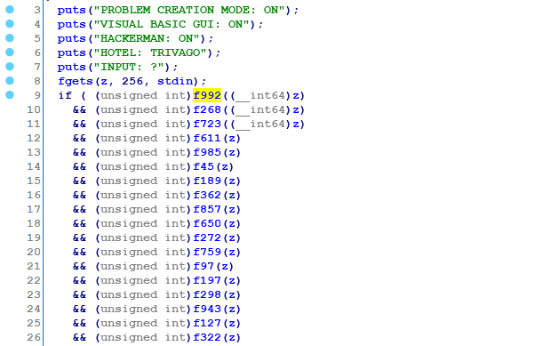  

Đây là bài crackme đơn giản với rất nhiều hàm check.  

Mỗi hàm check cũng khá đơn giản :  

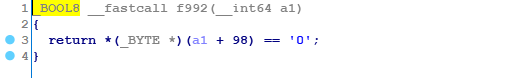  

Làm thủ công thì cũng ra được nhưng chắc chả ai làm theo cách này 🙄🙄🙄   

Chúng ta chỉ cần vài dòng lệnh là có thể giải quyết được vấn đề :  

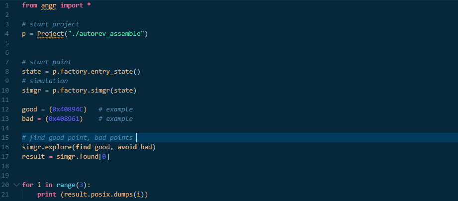  

Nếu muốn enhance thì có thể tham khảo link blog : [efiens](https://blog.efiens.com/tamuctf-2019/)  
Xưa mình cũng học trên này cộng với practice nâng cao thêm một số thứ nữa.   

## Califrobnication   

Simple C program :   

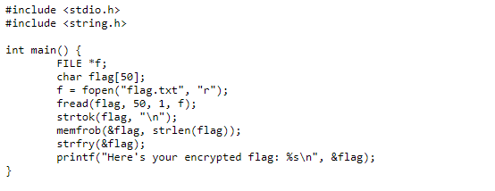  

Hmm có một số hàm khá lạ ở đây : `memfrob` và `strfry`.   

Sau khi google search thì mình biết được `memfrob` đơn giản là xor với 42. Ok không có gì khó cả.  

Hàm `strfry` sẽ random thứ tự của chuỗi được nhập vào. Muốn dịch ngược phải có source. Lại tìm [source.c](https://code.woboq.org/userspace/glibc/string/strfry.c.html). 

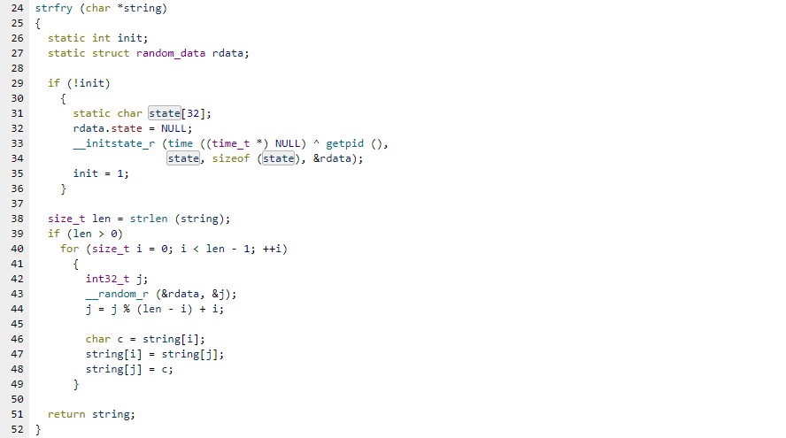  

Hàm này lại sử dụng một số hàm lạ như `__initstate_r` và `__random_r`. Bấm vào link trên rồi lại kéo source về.  
Quan trọng ở đây, hàm này pass 2 giá trị random là `time(0)` và `pid`.  

Vậy nên mình đã viết một file c implement lại hàm `strfry` này, thay giá trị `time(0)` và `pid`.  

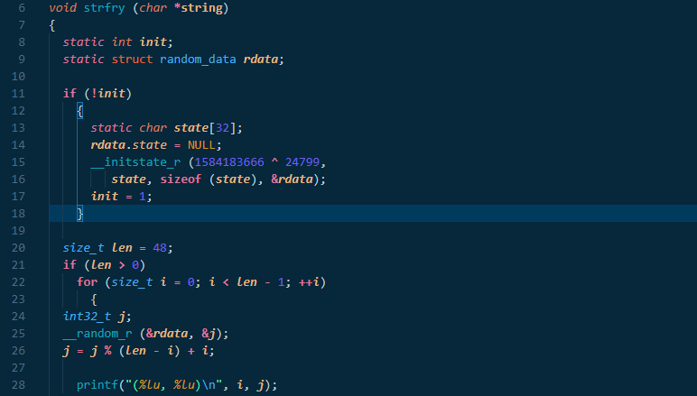   

In ra các giá trị các chỉ số đã được đổi chỗ, copy vào và reverse lại bằng python thôi.  =)))  


## Masochistic Sudoku  

Đây là một game về sudoku :  

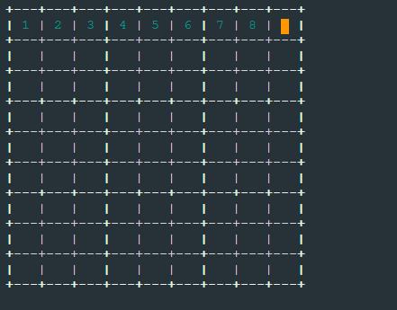  

Lượn lờ trong IDA một thời gian thì mình thấy có hàm check flag :   

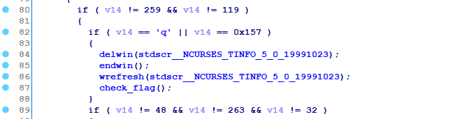  

Khi nhấn q nó sẽ thoát và thực thi hàm này.  

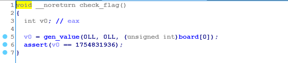  

Hmm hàm check flag ngắn thế này á 🤨🤨🤨 

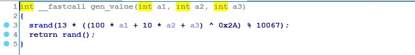  

Hàm `gen_value` chỉ là hàm random với `seed` khá nhỏ nên bruteforce được. Ta thấy sau khi gen value nó sẽ check giá trị random, nếu đúng thì tiếp tục thực thi.   

Thực ra có rất nhiều cái check như vậy :  

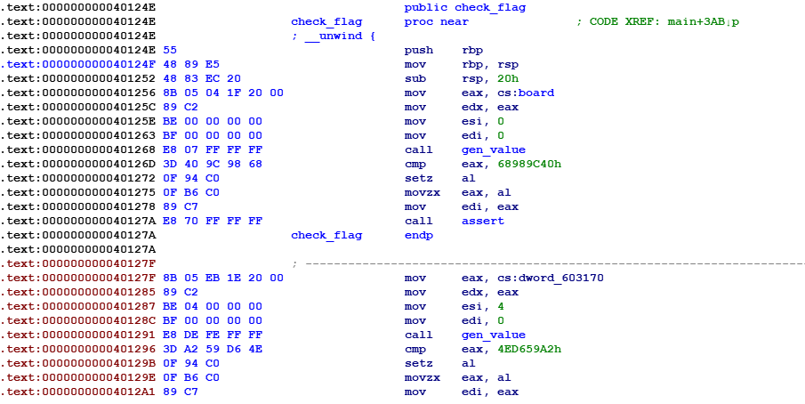  

Nhưng do IDA nó không hiểu, nên tưởng `assert` là kết thúc của hàm.  

Đến đây, mình dùng IDA python script để config lại đoạn assemble này để IDA có thể hiển thị hết. Do cái assert nó làm cho IDA không nhận được nên chỉ cần nop hết nó đi là ok.  

Script để nop từ một địa chỉ và số lượng kí tự nop. 

```python
def n(start,length) : 
 for i in range(0, length) : 
   PatchByte(start+i, 0x90) 
 MakeCode(start)
``` 
Nhưng có khá nhiều lệnh assert như vậy. Ta cần liệt kê hết.  
Sử dụng `Xref` (Phím tắt X) trong IDA ta sẽ liệt kê được tất cả địa chỉ gọi nó :  

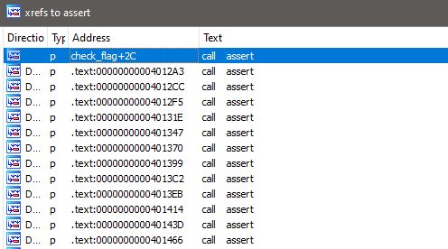  

Cũng với script trong ida, ta có script `xref` :  

```python
def getFun(addr) : 
    ret = []
    for xref in idautils.XrefsTo(addr):
        ret.append(xref.frm)
    return ret 
``` 

Lưu nó vào một mảng rồi dùng script `NOP` để nop hết thôi.  

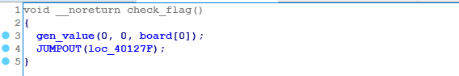

Sau khi Nop + F5, thì ra được thế này. Chúng ta cần `undefined` hàm cũ và define hàm mới.  

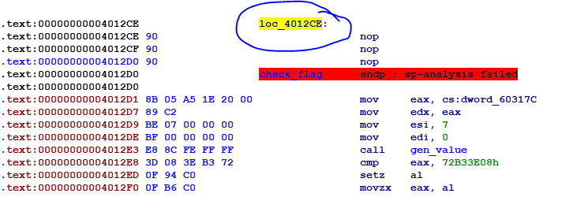  

Do có những cái `loc` như thế này, undefined hết bọn nó.  
Cuối cùng được code khá đẹp 🤗🤗🤗 :  

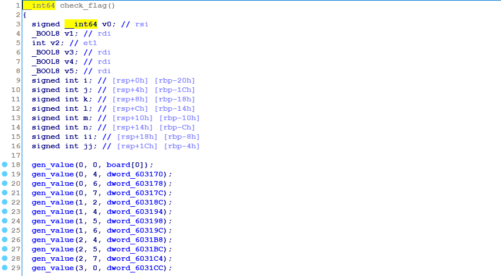 

Ở cuối hàm check flag, chúng ta có hàm in ra flag nếu vượt qua tất cả các check :  

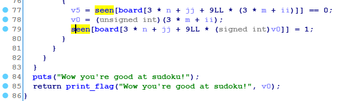  

Có một vấn đề là chúng ta bị mất cái giá trị so sánh ở chỗ `assert`. Ida đã tối ưu và bỏ qua nó.  

Tiếp tục thực hiện `xref` để tìm những vị trí có lưu giá trị so sánh, sử dụng câu lệnh sau để extract thông tin :  

```python
GetOpnd(addr, i) : lấy tham số thứ i của câu lệnh
```  

Ok sau đó chuyển hết sang file python rồi tìm được những giá trị của bảng sudoku. 
Sau đó cho lên một tool online để solve được sudoku hoàn chỉnh -> get flag =))   

## Just Rust  

File binary được viết bằng Rust 😐😐😐  
Which not belong to my wolrd :vv  

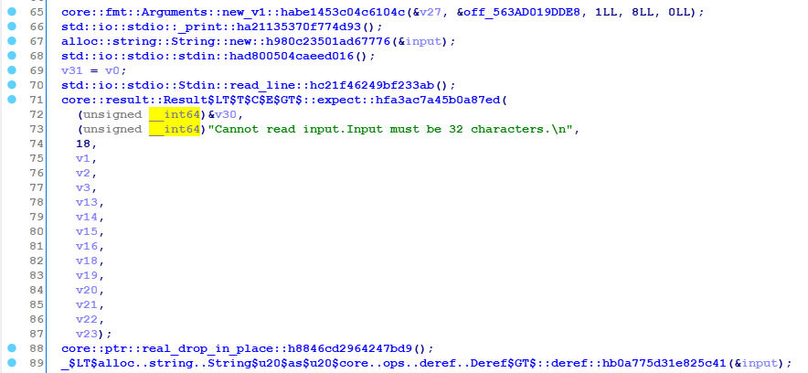  

Hàm thì tên dài phức tạp đến lạ lùng 🙄🙄🙄 Ok map sang C thì ta có thể xác định sơ sơ qua hàm nào làm hàm in ra, hàm get input, .... 

Len input phải là 32 kí tự.  
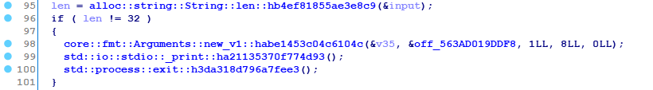

Đoạn lặp qua từng kí tự của string :  

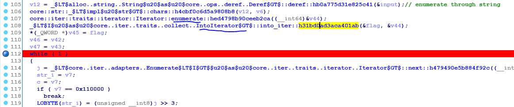  

Nó có mấy từ như `iterator`, `enumerate` nên map sang python nó sẽ dạng như :   

```python 
for j in "abcxyz" : 
```

Kết hợp với debug thì mình khẳng định được nhận xét trên.  
Tiếp đến :   

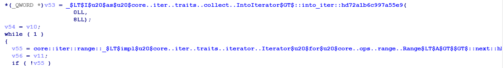  

Lại có các từ như `into_iter`, `range` thì lại map sang python sẽ có lệnh :  

```python
for k in range(0,8) : 
``` 

Cuối cùng :  

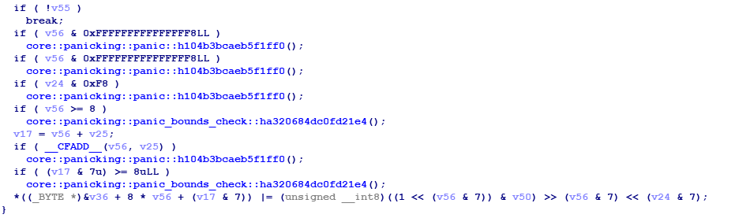  

Có một số hàm rất confusing, nhưng cái gì không hiểu thì cứ tạm bỏ qua. Debug thấy nó cũng ko làm gì cả 🙄🙄🙄  
Để ý dòng cuối cùng. Nó như kiểu một hàm encrypt vậy.  
Sau khi debug, mình convert ra được hàm mã hóa đầy đủ của nó như sau :  

```python
enc = [0x40] * 32 
for i, c in enumerate(flag) : 
    for j in range(8) : 
        enc[8 * j + (i+j)&7] |= (1<<(j&7) & c) >> (j&7) << (i >> 3) 
```

Để giải thích cho đoạn mã trên : 

```python
def xor_bit(num, bit, pos) : 
    num |= bit << pos 
    return num 

def get_bit(num, pos) : 
    return (num & (1 << pos)) >> pos 
for i, c in enumerate(flag) : 
    for j in range(8) :
        xor_bit(enc[8 * j + (i+j)&7], get_bit(c, j), i>>3) 
```
Việc còn lại chỉ là dịch ngược lại đoạn code khá ngắn trên thôi 😁😁😁 


