---
layout : post
title : Start learning exploit windows 
subtitle : with dadadb hitcon 2019 quals  
--- 

# Mở đầu  

😀😀😀 Mình thắc mắc tại sao một mảng như windows mà rất hiếm xuất hiện trong các kì thi CTF. Phải chăng vì nó khó setup với duy trì server chăng. Thế nên phải vất vả lắm mới tìm được link một số bài CTF về windows cũ để làm 😥😥😥 Mới đầu đã nhảy thẳng vào heap mà thôi cũng kệ, writeup của nó viết khá là chi tiết. Mình sẽ implement lại, để hiểu rõ exploit trên windows là gì (●'◡'●). Mở đầu với [dadadb hitcon 2019](https://github.com/scwuaptx/CTF/tree/master/2019-writeup/hitcon/dadadb).   

# Initial Setup  

Do exploit trên window nên mình sẽ dùng một thư viện tương tự pwntools là `winpwn`. Debug thì mình dùng `windbg`.  
Một số command useful khi dùng windbg :  
 + `lm` 
 + `!heap` 
 + `!heap -a [heap address]` 
 + `dt _HEAP`
 + `dt _HEAP_LIST_LOOKUP`
 + `dt _LFH_HEAP`

Mình thiết lập windbg với 4 cửa số chính như này sẽ dễ nhìn :   

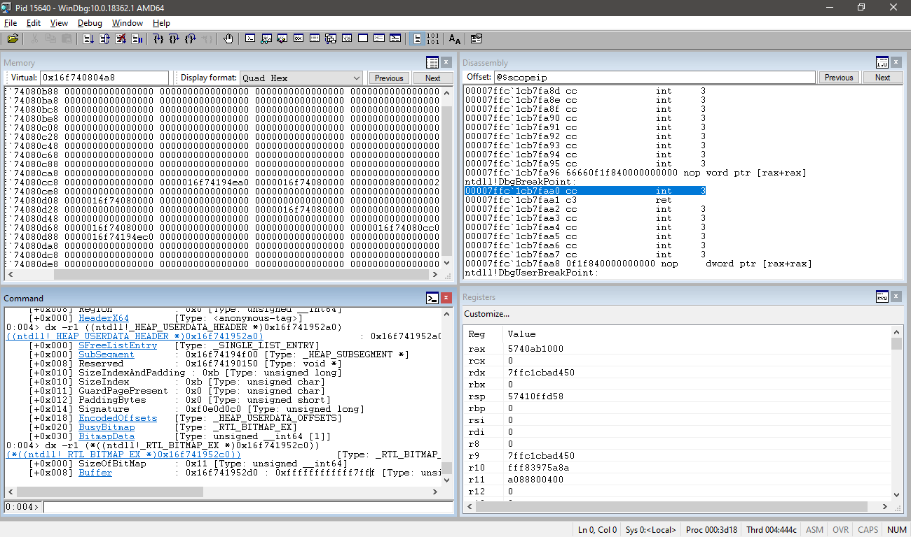  

Trong `winpwn` cũng có thể thiết lập tự động gọi `windbg`, đặt breakpoint các kiểu như trong `pwntools`. Nên việc setup debug cũng trở nên đơn giản hơn.   
Lưu ý bài viết này được thực hiện trên windows 10 1903. Các version khác có thể có sự khác biệt do cách implementation của heap là khác nhau 😓  

# Program Structure   

Đúng là binary của một giải lớn rating cao có khác. Dịch ngược chương trình cũng khó khăn hơn các bài khác rất nhiều. Để tối ưu thời gian nên mình cũng đọc writeup và nghiệm lại chương trình thì cũng hiểu được implementation của nó.😐  

Follow của chương trình sẽ như sau (copy paste from writeup 😂😂😂)  
+ Login

  + Read user data from "user.txt".

  + ADD
    + Add data by key
    + It will search node in table.
    + If not found, it will create new node and insert node to the table
    + Insert into in front of linked list
    + If found it will reuse the node and allocate a new data buffer
  + VIEW
    + Read data by key
    + It will use key to search node in table
    + If found, it will write data to stdout
  + REMOVE
    + Delete data by key
    + It will use key to search node in table
    + If found, it will delete the node in table and linked
+ Logout

Mỗi node trong table là một cấu trúc có dạng  :  

```c
struct node {
    char * data; 
    size_t size; 
    char key[0x41]; 
    struct node * next; 
}
```  

Table có dạng :  

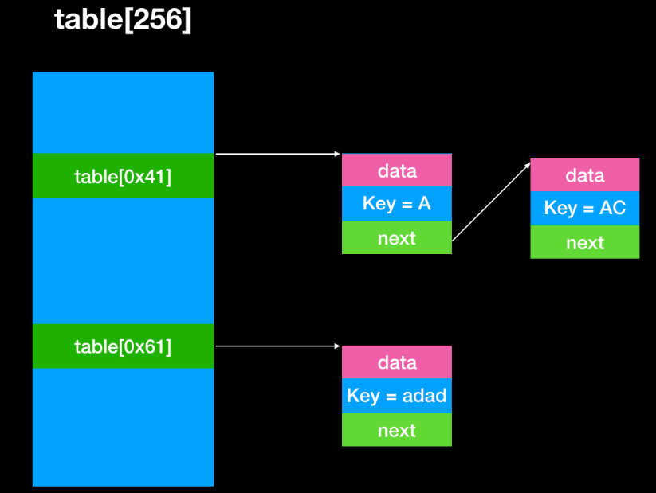   

Index trong table lấy từ kí tự đầu tiên của key. Nếu trùng, thêm vào trước của linked list. Thế nào là trước 🤔 Như trên hình, thứ tự add sẽ là : `AC -> A`.   

# Vulnerablility  

Khi dùng lại một key, nó sẽ free vùng data của node hiện tại và cấp phát một vùng nhớ mới, tuy nhiên nó lại vẫn đọc số byte lấy từ size cũ. Cho nên chúng ta có lỗi `heap overflow`.   

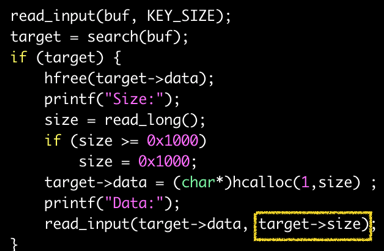  

# Arbitrary reading  

Do chương trình thực hiện private heap, cho nên các chunk được cấp phát sẽ liên tiếp nhau trên bộ nhớ như trên glibc bên linux 😶😶😶   

Bằng lệnh `!heap -a [heap address]` chúng ta có thể quan sát các chunk được cấp phát như nào :  

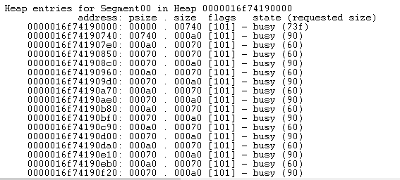  

Chunk 0x70 là vùng nhớ cấp phát cho node struct. Chunk 0xa0 là vùng nhớ cấp phát cho `node->data`. Nó liên tiếp nhau trên heap, vì vậy dựa vào lỗi overflow như trên ta có thể dễ dàng overwrite được con trỏ `node->pdata`, từ đó dùng chức năng view để leak thực hiện đọc tùy ý.  

Tuy nhiên, với default heap, các chunk được cấp phát sẽ không liên tục trên vùng nhớ heap. Việc này gây khó khăn cho tràn và chúng ta không thể ghi một các chính xác vào địa chỉ của `node->pdata`. Có một cách attack nhắm vào LFH có thể xử lí trong trường hợp này.   

Khi một chunk được cấp phát khi enable LFH, nó sẽ trả về giá trị random chọn từ một vùng nhớ chỉ định.  

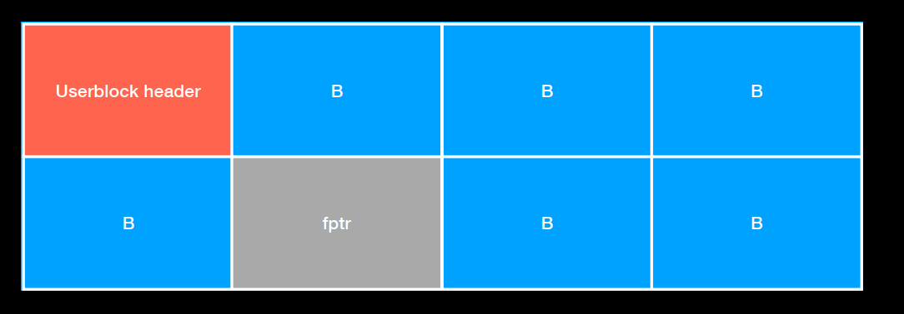  

Mỗi vùng nhớ đó tương ứng với từng size và có số lượng tối đa các block trong vùng nhớ đó. Giả sử một vùng nhớ size 0x60 có số block tối đa được cấp phát là 7. Nếu ta cấp phát 6 block. Block cuối cùng dù cho nó có thực hiện random nhưng chỉ còn 1 block chưa sử dụng nên nó sẽ luôn luôn trả về giá trị tại đó.  

```
malloc(A)   <-- return ptr 
free(A
malloc(A)   <-- return ptr  
```

Các bước thực hiện để leak sẽ như sau :  
  + enable LFH 
  + fill all userblock
  + free 1 node 
  + add(key, 0x60, 'a' * 0x70 + p64(addr)) 

Chúng ta có thể enable LFH bằng cách malloc 18 lần liên tiếp. Với node thì LFH sẽ được enable cho 2 chunk size là `0x70 - node malloc` và `0x90 - data malloc`.  

Sau khi chúng ta fill all userblock thì 2 userblock của 2 chunk size trên cũng đầy. Khi free 1 node, thì sẽ để lại một lỗ trên userblock. Như vậy, nếu ta thực hiện add key mới với data có size là 0x60, nó sẽ được cấp phát vào đúng cái lỗ đó trong userblock của size 0x70. Chunk kế tiếp của nó cũng là 1 node khác. Như vậy, có thể tràn 0x70 bytes sẽ tới `node->pdata` mà chúng ta cần ghi đè.   

### Debug 

Theo dõi `LFH_HEAP` có vẻ khó khăn hơn, vì nó không được liệt kê bởi lệnh `!heap`. Tuy nhiên, nếu hiểu được sao mà windows quản lí bọn `LFH` này thì cũng phải là không thể, chỉ là hơi lâu chút thôi.   

Sơ đồ mô tả cách quản lí LFH của windows  :   

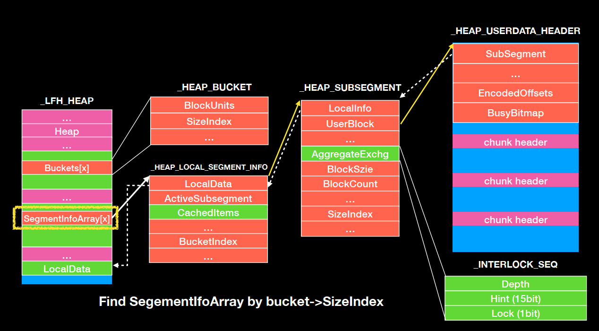  


Đọc cấu trúc `_HEAP` của vùng heap đang xét bằng lệnh `dt nt!_HEAP [heap address]`, ta thu được địa chỉ của Front End Heap tại `_HEAP + 0x198`.  
TIếp tục xem xét cấu trúc `_LFH_HEAP`, ta thu được :   

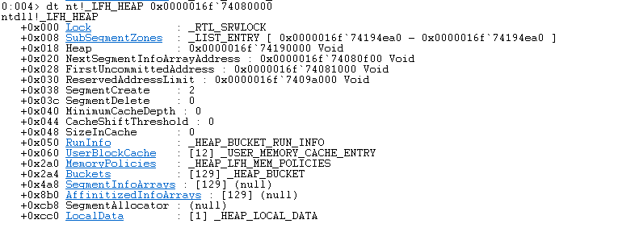  

Trong cấu trúc này, cần lưu ý : 
 + Buckets : cho chúng ta biết index từ size 
 + SegmentInfoArrays : lưu thông tin về từng subsegment tương ứng với từng size.  

Kích đúp vào phần `SegmentInfoArrays`, chúng ta thu được kết quả :  

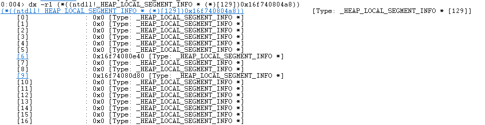   

Ta thấy chỉ có array [6] và [9] là có subsegment. Vì nó tương ứng LFH của size 0x70 và 0xa0.  
Lần theo `SegmentInfoArrays[6]`, chúng ta sẽ thu được thông tin về userblock này :  

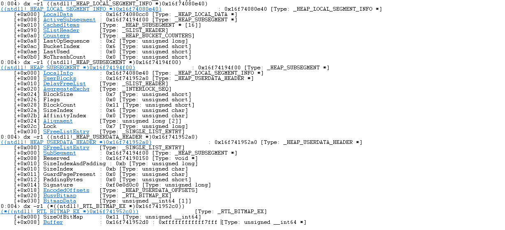  

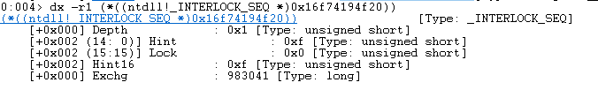  

`BusyBitmap=0xffffffffffff7fff` và `ActiveSubsegment->AggregateExchg->Depth` cũng bằng 0x1,  suy ra chỉ còn đúng 1 block còn khả dụng. Đúng như mục tiêu attack của chúng ta 😁😁😁  

## Leak what ? 

Leak trên windows cũng là cả một nghệ thuật. Trên Linux, khi có một lỗi đọc tùy ý, chỉ cần đọc bảng GOT là có thể recovery được libc base. Nhưng trên windows, mọi chuyện sẽ khó khăn hơn nhiều 🙃🙃🙃  

### ntdll address  
Do các hàm trong ntdll không được gọi trực tiếp nên không thể leak được địa chỉ của thư viện này bằng cách đọc IAT.  

Đọc địa chỉ ntdll tại `_HEAP->lock`.  
Cấu trúc `_HEAP` không có thuộc tính `lock`. Nó kiểu như một cái extended của cấu trúc `_HEAP` vậy. Nằm ngay cuối cùng của `_HEAP`.   

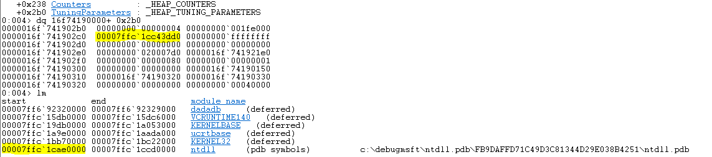  

```python
lock = readmem(heap+0x2c0)
```  

### PEB address  

Đọc địa chỉ PEB từ ntdll 🙄🙄🙄  
I don't know how and why but it 's there.  
Địa chỉ PEB được lưu cố định trên tại vùng bss của ntdll. Tùy từng phiên bản mà nó nằm tại những vị trí khác nhau.Với phiên bản ntdll trên máy mình thì nó nằm tại offset `0x165348`.  

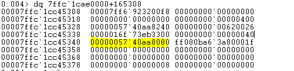  

Nó xấp xỉ nhau :v tìm xung quanh cái offset này là ra. Hope so 🤣🤣🤣   

### Binary Base Address  

```python
immol = pebldr + 0x20
ldrdata = readmem(immol)
bin_entry = readmem(ldrdata + 0x20)
```
Tìm địa chỉ pebldr như sau :   

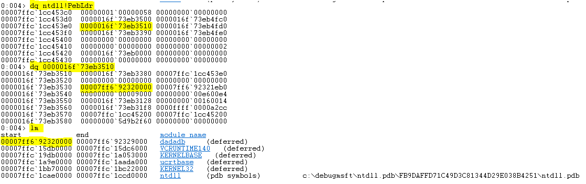   

### Kernel32 address  

Đọc IAT table để lấy địa chỉ một hàm trong thư viện này rồi trừ đi offset.  
```c
iat = bin_base + 0x3000
readfile = readmem(iat)
kernel32 = readfile - readfile_offset 
```

### Stack address 

Đọc từ TEB.  

```python
teb = peb + 0x1000 
stack = readmem(teb + 0x10) 
```

### Security Cookie  

```python
cookie = readmem(bin_base + 0x5008)
```  

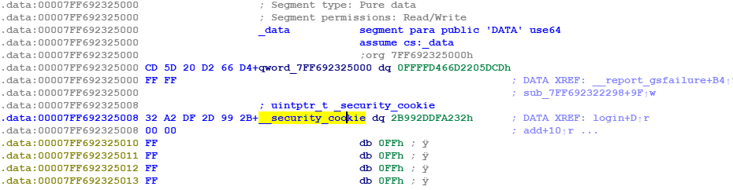  

# Arbitrary write   

Dựa vào lỗi heap overflow, chúng ta sẽ ghi đè lên Flink, Blink làm hỏng double linked list dẫn tới malloc tới một vùng chỉ định.   

## Step 1 : Chuẩn bị chunk A để ghi đè.  

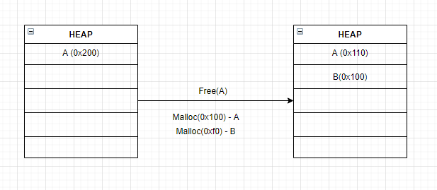  

Chunk A sẽ được dùng để ghi đè + leak thông tin từ chunk B.  

## Step 2 : Chuẩn bị 4 chunk liên tiếp có cùng size.  

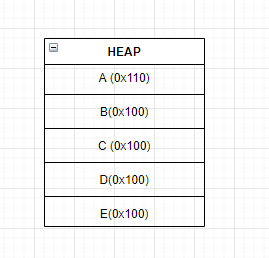  

Chỉ cần chunk B và chunk D có cùng size là được. Chunk C, E làm nhiệm vụ ngăn cách giữa chunk B, D và top chunk để tránh nó bị gộp lại thành 1 thôi 😀  

## Step 3 : Free D -> B  

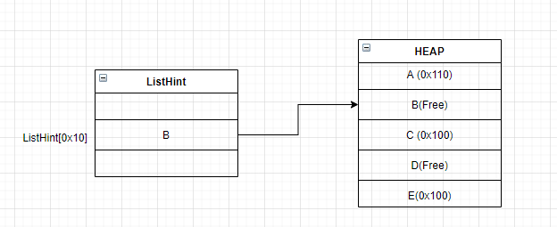  

Khi free theo thứ tự này, Chunk B sẽ được đặt vào `ListHint[0x10]`. Khi thực hiện `malloc(0xf0)` thì nó sẽ lấy chunk từ `ListHint[0x10]`, lần theo linked list để biết chunk nào cùng size rồi update `ListHint[0x10]` trong linked list đó.  

Do vậy, nếu ta ghi đè `Flink`, `Blink` của `B` thành địa chỉ chỉ định, thì sau khi malloc 1 lần, `ListHint[0x10]` sẽ được update thành địa chỉ chỉ định. 🍺🍺🍺 Bùm trong lần malloc tiếp theo nó sẽ malloc tới vùng nhớ chỉ định.  

## Step 4 : Ghi đè linked list  

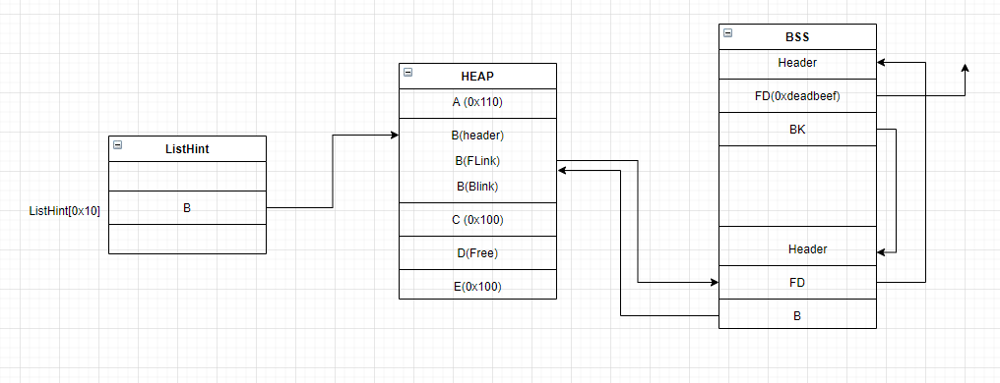 

Chuẩn bị 2 fake chunk có cùng size. Size này được thể hiện trong header của chunk. Để cho đơn giản, chúng ta chỉ cần lấy header của B thay vào là xong (*￣3￣)╭   

Cần ghi đè linked  list sao cho không làm hỏng double linked list. Cho nên cần tới 2 fakechunk cho điều này.  

Chunk thứ hai, FD có thể là bất kì giá trị nào không ảnh hưởng, vì khi unlink B ra khỏi linked list thì nó không check tới đoạn này.  

Sau khi malloc 1 lần, `ListHint[0x10] = Target` .  

Trong bài này, chúng ta sẽ thực hiện ghi đè lên BSS với hai fake chunk là `username` và `password`. Chúng ta có thể place fakechunk sau `username` thật ngăn cách bằng `\x00` vì hàm compare chỉ duyệt tới `\x00` nên ta vẫn có thể login success.   

## Step 5 : Ghi đè File pointer  

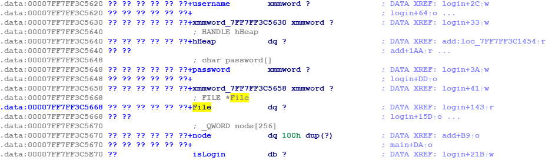  

Sau khi malloc được lên bss, chúng ta sẽ dùng nó để ghi đè `File`. `File = fopen("user.txt", 'r')`.  

**Make file structure great again**.  

Khi ghi đè file struct, ta có thể dùng hàm `fread` để ghi đè lên địa chỉ tùy ý.   

```python
cnt = 0
_ptr = 0
_base = ret                 # <-- địa chỉ ghi đè 
flag = 0x2080
fd = 0                      # <-- đọc từ stdin 
bufsize = 0x100+0x10        # <-- kích thước 
fakefp = p64(_ptr) + p64(_base) + p32(cnt) + p32(flag) + p32(fd) + p32(0) + p64(bufsize) +p64(0)
fakefp += p64(0xffffffffffffffff) + p32(0xffffffff) + p32(0) + p64(0)*2
fakefp_address = password + 0x20
add("GGGG", 0xf0, 'a' * 0x10 + p64(fakefp_address) + p64(0) + fakefp) 
```  

Bài này sẽ không đi sâu vào File struct :v Có thể tham khảo thêm slide của `Angel Boy` để hiểu thêm về vấn đề này.  

# ROP  

Do chương trình không cho gọi subprocess nên chúng ta có thể gọi `VirtualProtect` từ `kernel32` để thay đổi quyền thực thi của một vùng nhớ.  

```
# change mem-> mem + size to R|W|X 
VirtualProtect(mem, size, 0x40, valid_address)  
```

Do ta có thể leak tất cả địa chỉ nên thực hiện gọi hàm `VirtuaProtect` khá dễ dàng.  

Tìm gadget `pop` bằng trang [ropshell.com](http://ropshell.com/search). Tìm bằng gadget của Linux nó không ra hết gadget :v   

Final rop như này :   

```
pop_rdx_rcx_r8_r9_r10_r11 = ntdll + 0x8c430
buf = bin_base + 0x5800
rop = ''
rop += p64(pop_rdx_rcx_r8_r9_r10_r11) 
rop += p64(0x1000) + p64(shellcode_addr) + p64(0x40) + p64(shellcode_addr - 8) + p64(0) * 2
rop += p64(virtual_protect)
rop += p64(shellcode_addr)
```

Shellcode có thể đặt tại heap và leak địa chỉ từ các bước trước.  

Thành quả :   

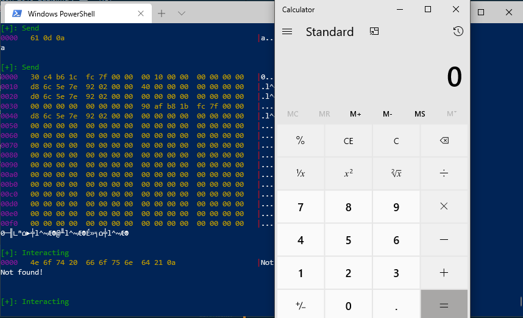  

😍😍😍 Popup calculator.   

Exploit in windows is fucking hard ___*( ￣皿￣)/#____  


 


