---
layout : post
title : NahamCon CTF 2020 
--- 

# Mở đầu  

Khoảng thời gian gần đây bận vài việc nên cũng không chơi CTF được nhiều :v Mùa hè lại đến, hi vọng chúng ta có thể bứt phá một cái gì đó mới trong hè này 😁😁😁 
Tuần này team Nupakachi có chơi giải Nahamcon CTF 2020 .  

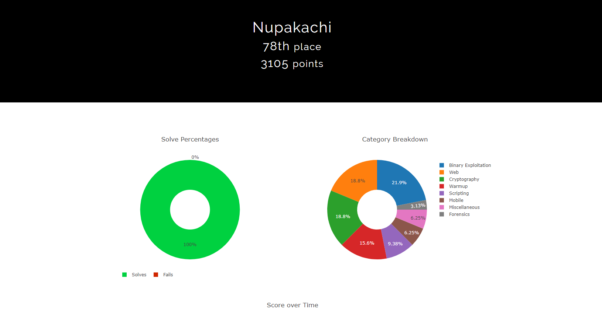 

Pwn của giải này mình thấy không quá khó mà cũng khá là hay, mới mẻ 😀  

# Table of content  

 + [**[PWN] Shifts-ahoy**](#wu1) 
 + [**[PWN] Converyor**](#wu2) 
 + [**[PWN] Free-willy**](#wu3)  
 + [**[PWN] leet-xor**](#wu4) 

<a name="wu1"></a>
## Shifts-ahoy  
Đây là bài mình cảm thấy thú vị nhất trong các bài pwn. :v  

Chương trình bao gồm 2 hàm cơ bản  :  

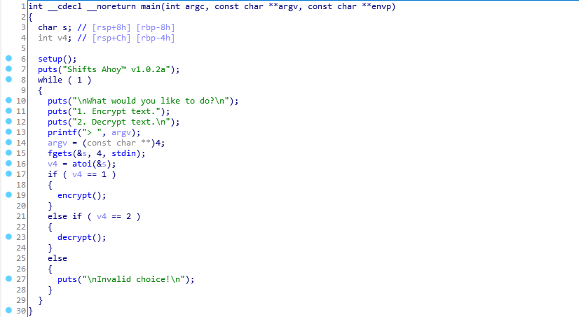  

Hàm `encrypt` : 

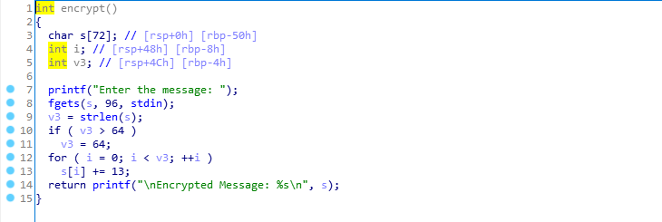 


Hàm `decrypt` thì không làm gì nhiều.  

Chúng ta có thể dễ dàng nhận ra lỗi tràn ở hàm encrypt. Tính toán độ tràn thì chỉ tràn được tới địa chỉ trở về. Điều này gây khó khăn cho việc ROP của chúng ta. Thông thường, chỉ cần tràn tới puts rồi leak địa chỉ,trở về main và call `system`.  
Tuy nhiên, nó cần tới 24 bytes tràn kể từ địa chỉ trở về, trong trường hợp này chúng ta lại chỉ có 8 bytes. 😅  

Kiểm tra các cơ chế bảo mật :  

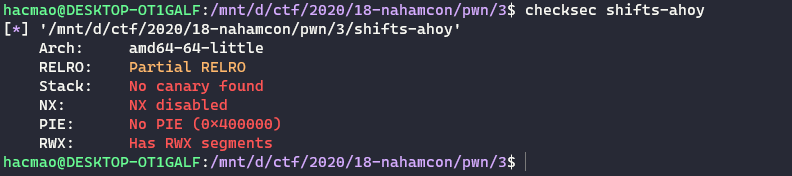  

Không có NX, như vậy khả năng cao bài này sẽ đi thực thi shellcode. Nhưng một câu hỏi là ROP về đâu :v  

Do có khả năng sử dụng shellcode nên không cần lo tới việc leak libc nữa. Với shellcode, ta luôn cần đặt ra 2 câu hỏi : 
 + Đặt ở đâu? 
 + Chạy như nào?  


Biến `Buf` có độ dài khá lớn, đủ chứa shellcode. Nhưng nó nằm trên stack, và chúng ta lại chưa có địa chỉ stack để nhảy tới.  

Tới đây, chúng ta có thể thực hiện một kĩ thuật gọi là `stack pivot`, thay đổi luồng thực thi của chương trình lên một vùng nhớ đã biết địa chỉ, cụ thể là `bss`.  

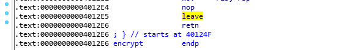  

Lưu ý, khi kết thúc một hàm, chương trình sẽ thực hiện xóa frame của hàm và trả lại `rbp` cũ. Như vậy, nhờ vào việc tràn chúng ta có thể kiểm soát được `rbp`.  

Trong khi tìm kiếm một địa chỉ để trở về, mình thấy một đoạn khá khả thi :  
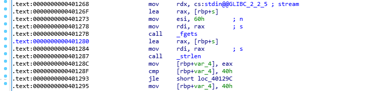  

Khi gọi lại hàm `fgets`, nó sẽ đọc kí tự vào vùng nhớ tại `rbp-0x50`. Mà địa chỉ `rbp` do chúng ta control. 😁  

Sau đó, nó tiếp tục thực thi chương trình, nhưng frame của hàm đang là trên bss. Một địa chỉ ta đã biết. Với shellcode đặt tại đây, ta sẽ ret được về shellcode :v  

Khi làm, cần lưu ý đến dấu `newline`. Do hàm `fgets` nó chỉ nhận `0x5f` giá trị, do đó những giá trị thừa, nó sẽ tự động update cho `fgets` đằng sau nên ta ko thể input gì thêm được. Nhập đủ lượng kí tự là điều cần thiết.  

<a name="wu2"></a>
## Converyor  

Chương trình có 2 hàm cơ bản là `add_part` và `safety_check`.  

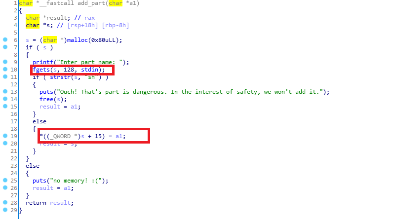  

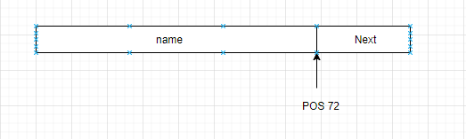  

Với hàm `safety_check`, chúng ta có thể tràn tới `Next` :  

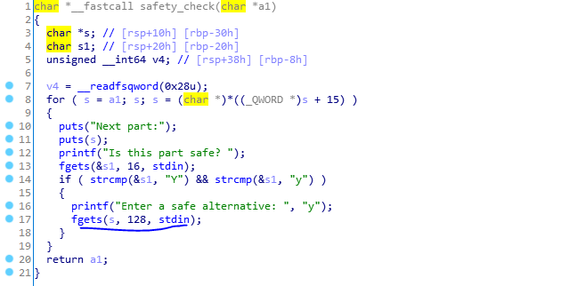  

Các node này nó tạo thành liên kết đơn, khi kiểm soát được con trỏ `next`, chúng ta đã kiểm soát được liên kết đơn này. Thay đổi nó thành địa chỉ `GOT` của một hàm nào đó, dựa vào hàm `puts` ta sẽ leak được libc.  

Tiếp đến, dùng chức năng sửa bên dưới, sửa `GOT` thành hàm `system`.  

Trong bài này, hàm `atoi` là lựa chọn tốt nhất để thay đổi thành `system` vì mình có thể kiểm soát input truyền vào thành `/bin/sh`.  
Bùm ez shell 😂  


<a name="wu3"></a> 

## Free-willy  

Câu chuyện về những chú cá voi :v  
 
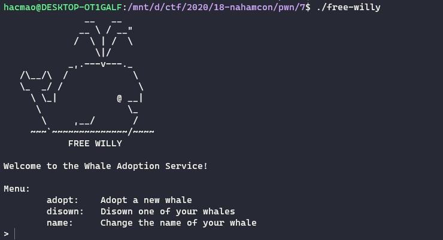  

Trông con cá voi khá là tếu.  
Chương trình có 4 hàm cơ bản, tuy nhiên ta chỉ cần quan tâm tới 3 hàm đầu tiên :v  

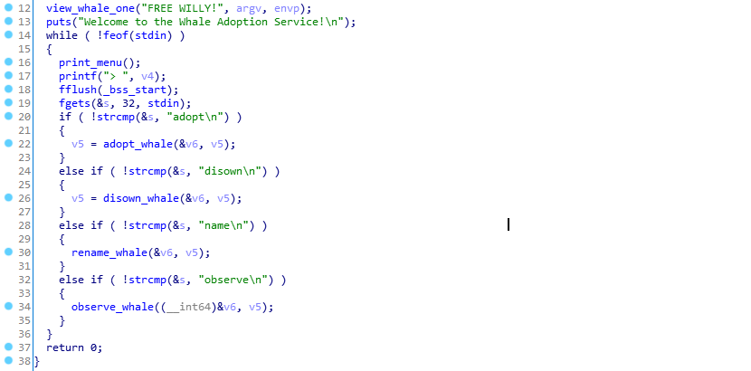  

Hàm `adop_whale` có nhiệm vụ tạo node có struct như sau :  

``` 
struct node{
    long int none;    <-- not use 
    long int pname;   <-- address of name 
    long int size; 
    long int type; 
}
```  


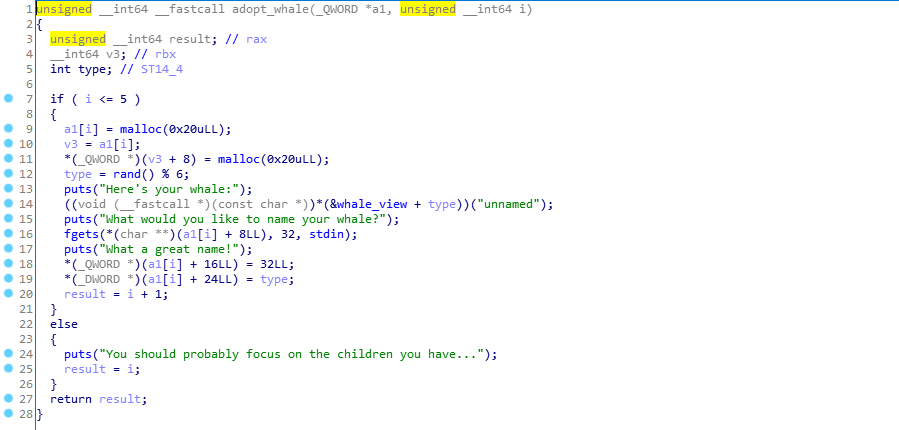 

Hàm `disown_whale` dùng để free node, tuy nhiên có một lỗi nghiêm trọng là không clear con trỏ giữ địa chỉ của malloc có thể dẫn tới lỗi `use after free` và `double free`.  

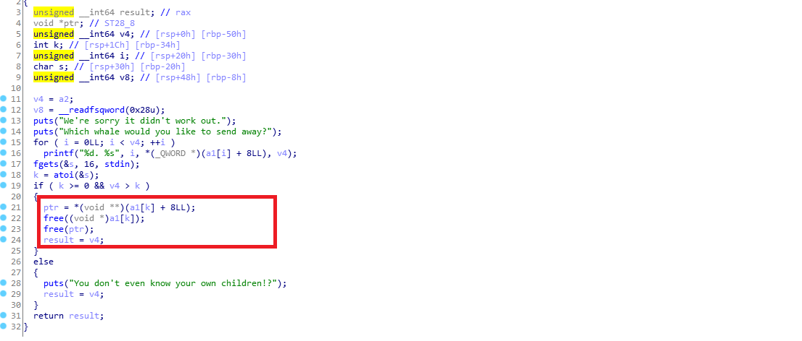  

Hàm `rename_whale` cho phép chúng ta chỉnh sửa node :  

  

Sau khi free 1 whale, nếu node đó không phải là top chunk thì trong tcache bin sẽ có node như sau :  

```
pname -> pnode
```

Như vậy khi ta xin cấp phát 1 chú cá heo nữa, địa chỉ của pnode của chú cá heo này sẽ là địa chỉ `pname` của chú cá heo vừa bị xóa đi, `pname` lại là `pnode`.  

Chúng ta có thể dùng chú cá heo này với chức năng chỉnh tên để thay đổi giá trị `pname` của chú cá heo trước thành `GOT`.  

Khi đã có `GOT` thay cho địa chỉ main, dùng chức năng chỉnh sửa với 1 chú cá heo không tồn tại, ta sẽ leak được địa chỉ libc mà không tổn hai đến node nào.  

Khi leak được địa chỉ libc xong, dùng chức năng chỉnh sửa chú cá heo đã xóa để thay đổi `GOT` thành địa chỉ hàm `system`.  
Việc còn lại chỉ là chọn hàm nào để thay đổi thôi. Trong trường hợp này, hàm `free` là thích hợp nhất vì chúng ta có thể pass `/bin/sh` cho tên của con cá heo. 😋😋😋

<a name="wu4"></a>

# Leet haxor  

Bài này là một bài cung cấp 2 chức năng chuyển đổi kí tự sang dạng leet xor. Tuy nhiên lại có 1 lỗi cơ bản là format string.  

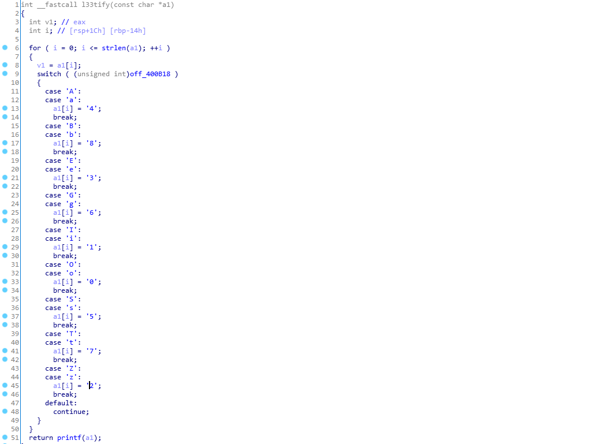  

Với việc sử dụng ultimate được `printf`, việc exploit là khá dễ dàng.  

Mình dùng đoạn script tương tự như này để thực hiện ghi lên `GOT` : 

```python
# len(payload) ~ 27
def format8(str) : 
    return str + '0' * (8 - len(str) % 8)

puts_got = 0x601018 
part1 = one_gadget & 0xffff
part2 = (one_gadget & 0xffff0000) >> 16
if part2 < part1 : 
    part2 += 1 << 17

payload = "%" + str(part1) + "x%12$hn%" + str(part2 - part1) + "x%13$hn"
payload = format8(payload) + p64(puts_got) + p64(puts_got+2)
```


