---
layout : post
title : Zh3r0 CTF 2020 
--- 

## Mở đầu  

Tự nhiên có giải CTF giữa tuần lên ngó xem thế nào 😁😁😁 Giải này trải nghiệm quả không tệ, mấy bài của nó cũng khá hay, mình cũng học thêm được 1 số thứ.  

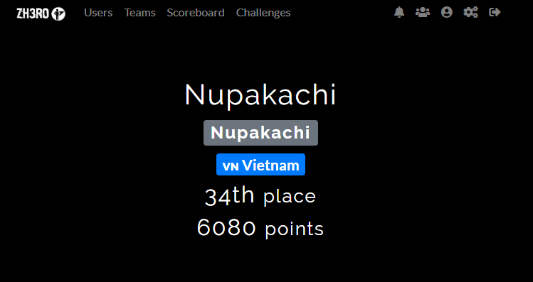  

## Table of Contents  
 + [**[REVERSE] Fun**](#wu1) 
 + [**[PWN] Command-1**](#wu2)
 + [**[PWN] Help**](#wu3)
 + [**[PWN] \x32\x64**](#wu4)
 + [**[PWN] Command-2**](#wu5)

<a name="wu1"></a> 

## [REVERSE] Fun  
Chương trình là 1 file crack-me ELF 64 bit :  

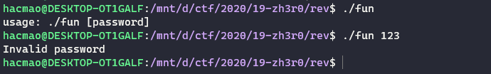 

Chương trình thực hiện một lượng công việc khá là nặng nề :  

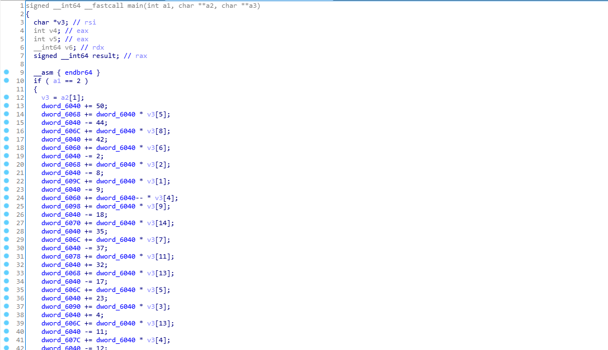   

Cuối cùng là đoạn so sánh quen thuộc :  

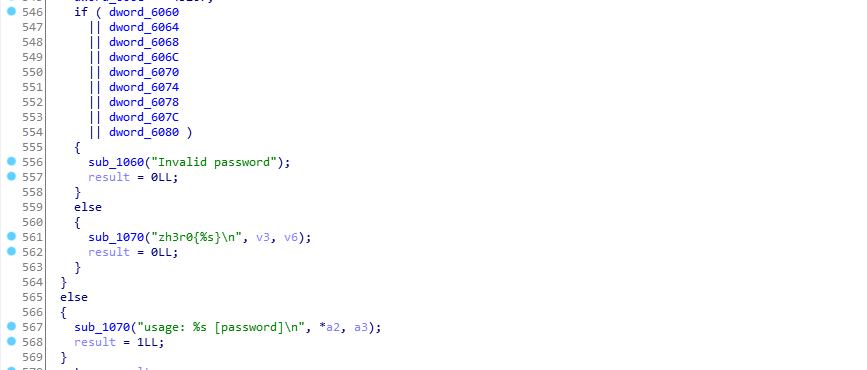  

Phân tích đoạn cộng trừ mã hóa kia, tiến hành đổi tên để cho dễ nhìn hơn dễ hình dung hơn 😋  

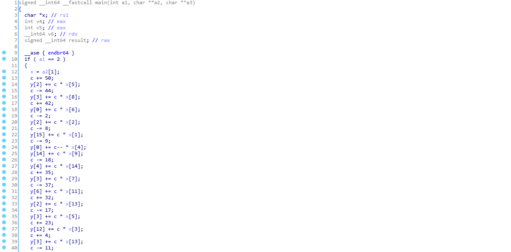  

Từ đó ta có thể đưa ra kết luận là đoạn mã hóa lằng nhằng này thực chất chỉ là việc đi xây dựng hệ phương trình bậc nhất 16 phương trình 16 ẩn. Do đó chúng ta sẽ có nghiệm duy nhất.  

Bài này có 1 cái trick là nó lại không check hết cả 16 phương trình mà chỉ check 9 cái thôi :)) Nếu chỉ dùng điều kiện 9 cái thì sẽ không đủ dữ liệu để giải ra nghiệm. 😁😁😁 Nhưng người ta cho cái gì cũng sẽ có lí do, nên mình mới nghĩ tới việc check đủ cả 16 cái.  

Việc còn lại là tìm được hệ phương trình này. Mình rất thích mấy bài kiểu automatic reverse này,  viết code rất phê 😀 Mình đưa ra 2 hướng khả thi :  
 + dùng unicorn để chạy và gen ra hệ phương trình
 + dùng angr 

Cách 1 có thể tốn khá nhiều giấy mực khi cần phân tích cấu trúc câu lệnh nên mình chọn lựa chọn 2 trước.  

Do chương trình chỉ check 9 phương trình ko đủ dữ kiện gì đó mà chạy angr thuần ko ra kết quả gì được. 😅 Do mình chỉ là người đi sử dụng tool nên không hiểu được nền tảng thuật toán người ta sử dụng nên cũng không hiểu được vì sao nó fail. Có thể do quá phức tạp nên nó không giải được thôi.  

Như ý tưởng bên trên, hiện tại chỉ cần đi tìm được tất cả các hệ phương trình là được. Angr có thể làm được điều này 🤗🤗🤗  

Đầu tiên, vẫn là các bước setup quen thuộc :  

```python
import angr 
from claripy import *
p = angr.Project("./fun")
``` 

Tiếp đến, chúng ta cần tạo biến `x` đầu vào là một string gồm 16 kí tự. Tạo biến cho hàm main nên ta có thể sử dụng `entry_state` và `args`.    

```python
arg1 = BVS('arg1', 16*8)
state = p.factory.entry_state(args=['func', arg1])
```

Ta định nghĩa điểm dừng : 

 

```python
good = (0x403C74)
simgr = p.factory.simulation_manager(state) 
simgr.explore(find=good)
solution_state = simgr.found[0]
```

Điểm dừng sẽ là ngay trước đoạn so sánh, lúc này chương trình sẽ thực thi xong đoạn sinh hệ phương trình nên ta có được tất cả các phương trình cần thiết 😁 Mặc dù chả biết nó như nào nhưng miễn là nó tồn tại là được.  

Giai đoạn tiếp theo là lập hệ từ các phương trình đã có :  

```python
for i in range(16) :  
    var = solution_state.memory.load(0x406060 + 4 * i, 4) 
    solution_state.solver.add(var == 0) 
```  

Chúng ta sẽ lấy phương trình từ mảng `0x406060`, rồi tạo phương trình `==0`.  

Cuối cùng, in flag ra thôi :  

```python
print(b"zh3r0{%s}" % solution_state.solver.eval(arg1, cast_to=bytes))
```

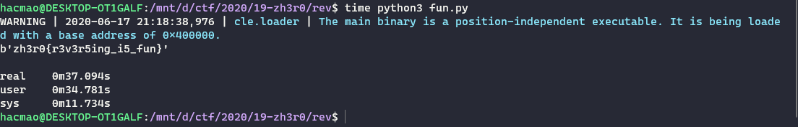  

Còn 1 bài reverse về `Rust` thì thôi éo viết, ra được phần đầu của flag xong đoán phần còn lại. Tấu hài vl :)) 

 

 

<a name="wu2"></a>

## [PWN] Command-1  

Bài này không biết có phải tác giả không filter hay ko :v CÒn ko phải viết script python nữa mà netcat cũng xong luôn.  

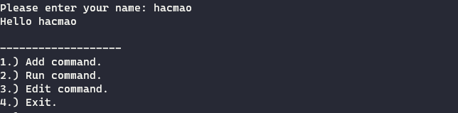  


Chương trình có 3 lựa chọn :  
 + Thêm lệnh
 + Chạy lệnh
 + Sửa lệnh 

Thêm lệnh nó sẽ filter để chúng ta không có được shell, chạy lệnh bằng hàm `system`.  
Tuy nhiên, một cách dễ dàng là có thể dùng ` sửa lệnh ` để nhập vào chuỗi `/bin/sh` và có shell 😂😂  

<a name="wu3"></a>  

## [PWN] Help  

Chúng ta có một lỗi tràn 1 bytes :v 

  

Nhưng do hàm này được gọi bằng một hàm nội bộ nên có thể dùng 1 bytes này để chuyển luồng thực thi sang hàm khác :  

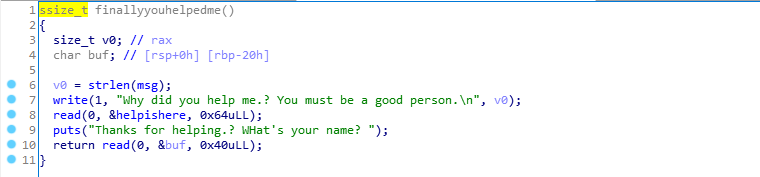  

Tại hàm này, ta có lỗi tràn dài hơn tí : `0x18` bytes. Tuy nhiên đây là file 64 bit nên nó cũng không đủ để làm kiểu tràn thông thường.  

Ta có hai chỗ để nhập string :  
 + stack : 0x40 bytes - 0x18 bytes để ROP 
 + bss : 0x60 bytes để ROP 

Sử dụng kĩ thuật `stack pivot` như đã nói ở ngay writeup `NahamCTF` lần trước, ta dùng `leave;ret` để thực hiện chuyển luồng thực thi lên bss.  

Tại đây, ta có thể đặt `pop_rdi+got+plt` để leak được địa chỉ libc. Tiếp đến, dự định đầu là quay trở lại trực tiếp hàm `finallyyouhelpme` để có thể thực hiện tràn tiếp. Tuy nhiên nó lại hành động rất lạ lol :))  

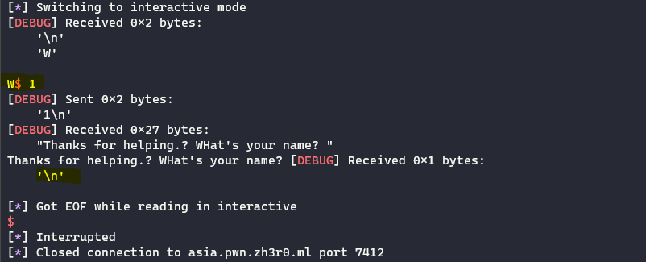  

Maybe là vì một lí do nào đó. Tuy nhiên, có 1 hướng đi khác là ta setup lại `rbp` thành `bss` và trở lại hàm `read` :  

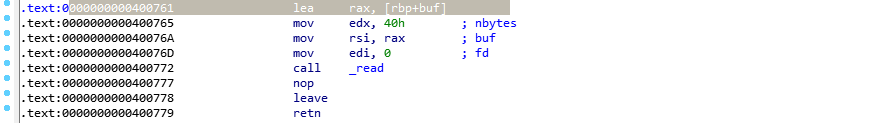  

Tại đây, chúng ta vẫn có lỗi tràn như trên nên có thể gọi gadget :))  

<a name="wu4"></a>  

## [PWN] \x32\x64

Bài này là một bài khá thú vị, mình học được thêm về các kiến thức về x32, x64 sau khi làm bài này. 😀  
Chương trình được viết bằng thuần asm.  

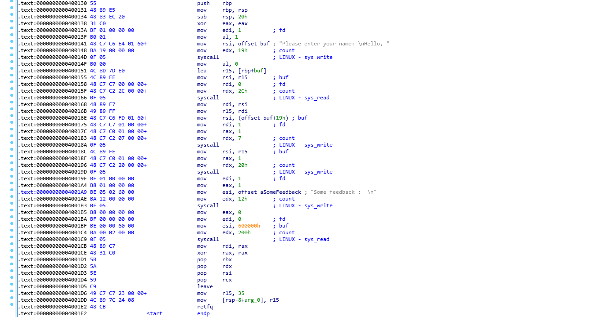  

Chương trình có 2 lần input : 
 + input 1 : `0x2C` bytes, có 4 bytes tràn 
 + input 2 : `0x200` bytes lên bss  

Có một lệnh khá lạ làm cho chương trình hành động kì lạ là `retfq`.  
Lệnh này thực chất vừa để `ret` lại dùng để chuyển mode về `32bit` =))) Ảo vcl. 😅 Lúc đầu không biết cứ debug loạn lên. Sau mới được admin hint là `Are you running on 32bit or 64bit` :v lên google lại kiếm được 1 bài wu về `retf`, nó nói là để change mode lúc này mới chắc chắn được.  

> 4 bytes tràn, ret về đâu ?  

Lượn qua lượn lại binary, thấy có một đoạn gadget khá thú vị :  

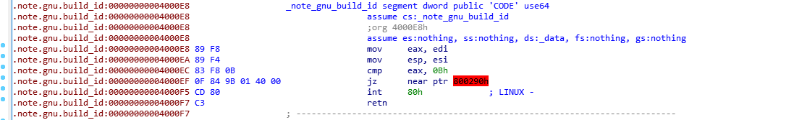  

Nó là đoạn gadget duy nhất cho ta chủ động set được giá trị của `eax`. Thanh ghi `rdi` có thể kiểm soát bằng số byte nhập vào trong lần input thứ hai.  

Từ đây, mở ra nhiều hướng tấn công : 
 + Dùng kĩ thuật `SROP`, mình đã đến được đoạn setup các giá trị của thanh ghi thành công nhưng khi thực thi `int 80h` thì bị lỗi gì đó 😖 
 + Dùng các hàm như `Open`, `Read`, `Write` để đọc file flag, tuy nhiên ta lại chỉ set được giá trị của `rdi` duy nhất 1 lần, nên cách này cũng bị loại bỏ. 
 + Cuối cùng, gọi `mprotect` để sửa quyền thực thi của bss để chạy shellcode.  

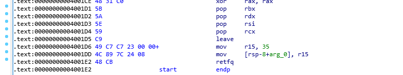 

Đoạn mã này cho phép chúng ta set tất cả thanh ghi cần thiết cho 32bit nên ta có thể thoải mái gọi `mprotect`.  

Do sau đó, chúng ta cần `ret` tới shellcode nên cần đặt giá trị `rsi = rsp = shellcode_addr`.  Done 🥰  

<a name="wu5"></a>  

## [PWN] Command-2  

Đây là một bài heap đơn giản.  

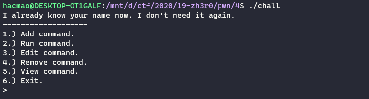  

Chúng ta được add 1 size tùy ý :  

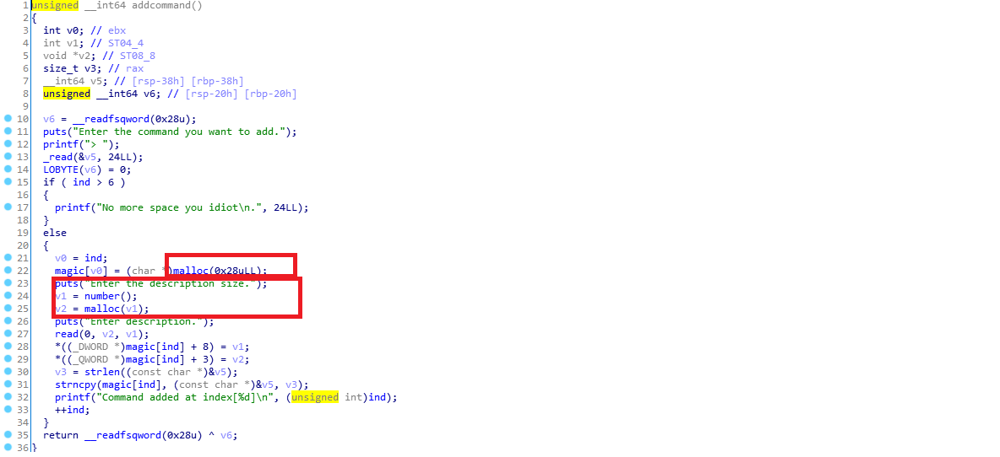  

Max là được 6 lần 😗  

Đồng thời, một lỗi khá rõ ràng là free mà không zero con trỏ, dẫn tới lỗi double free và use after free.  

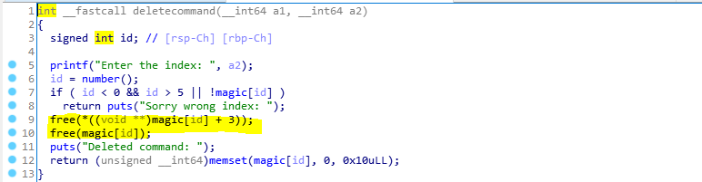

Với lỗi `useafterfree`, chúng ta có thể leak được địa chỉ của libc.  
Do binary được thực thi trên phiên bản ubuntu 18.04 nên sẽ có tcache. Để leak được thì ta cần cấp phát một chunk có size đủ lớn. Mình lấy là `0x600` cho chắc, free nó rồi dùng hàm `viewcommand` để in ra địa chỉ `main arena`. Bằng debug, tình toán ngược trở lại được libc.  

Tiếp đến là lỗi `doublefree`, có thể dễ dàng tận dụng để ghi đè lên `free_hook`.  
Xong game. 😁  


