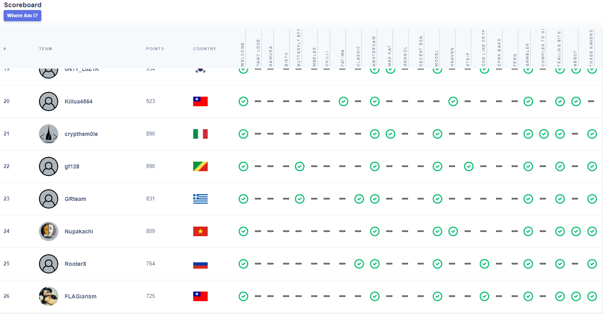
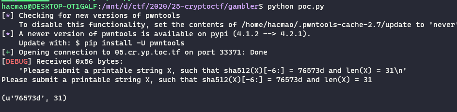
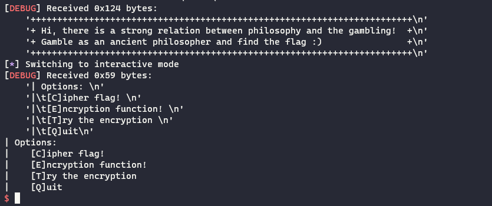
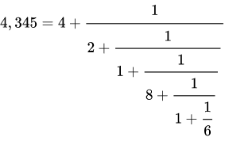
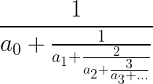
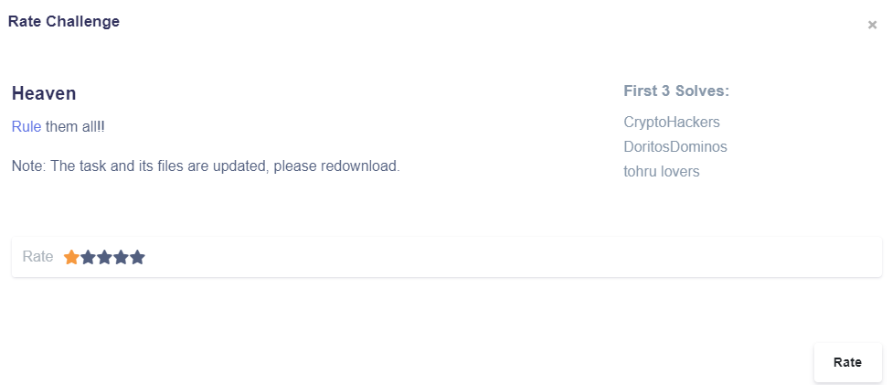

# Crypto CTF 2020 

  


Cuối tuần này mình có chơi CryptoCTF 2020 và kết thúc với 7 challenges được hoàn thành 😁 Không phải quá tệ với một thằng lâu rồi không chơi Crypto như mình. Còn khá nhiều challenge mình chưa thể hoàn thành 😂😂 và script bruteforce thì vẫn chạy xuyên màn đêm mà không biết bao giờ mới ra kết quả. Sau giải này, mình mới biết máy mình còn yếu hơn cả `google cocacl`. sad =((  

# Table of contents  
 + [**Three ravens**](#wu1)  
 + [**Amsterdam**](#wu2)  
 + [**Gambler**](#wu3)  
 + [**Model**](#wu4)  
 + [**Abbot**](#wu5)  
 + [**Haven**](#wu6)  

<a name="wu1"></a>  

# Three ravens  

```python
def keygen(nbit):
	while True:
		p, q, r = [getPrime(nbit) for _ in range(3)]
		if isPrime(p + q + r):
			pubkey = (p * q * r, p + q + r)
			privkey = (p, q, r)
			return pubkey, privkey
```
Đây là một challenge RSA đơn giản. Với hàm `keygen` như trên. Ta thấy public key được tạo thành từ hai thành phần là `p*q*r` và `p+q+r`.  

Tới đây, chắc có bạn rất dễ bị lừa khi follow vào việc phân tích tìm `p, q,r` tuy nhiên điều đó là hoàn toàn không cần thiết khi `p+q+r` là một số nguyên tố và đã biết rõ giá trị.  

Do đó, ta có thể quy về module là `p+q+r` rồi tìm phi của nó và giải như bài toán RSA thông thường.  

```
enc = pow(m, e, n) 
-> enc = enc % (p+q+r) === pow(m, e, p+q+r) 
```  

<a name="wu2"></a>  

## Amsterdam   

**Challenges** 

```python
def comb(n, k):
	if k > n :
		return 0
	k = min(k, n - k)
	u = reduce(operator.mul, range(n, n - k, -1), 1)
	d = reduce(operator.mul, range(1, k + 1), 1)
	return u // d 

def encrypt(msg, n, k):
    # part 1 
	msg = bytes_to_long(msg.encode('utf-8'))
	if msg >= comb(n, k):
		return -1
	m = ['1'] + ['0' for i in range(n - 1)]
	for i in range(1, n + 1):
		if msg >= comb(n - i, k):
			m[i-1]= '1'
			msg -= comb(n - i, k)
			k -= 1

	# part 2 
	m = int(''.join(m), 2)
	i, z = 0, [0 for i in range(n - 1)]
	c = 0
	while (m > 0):
		if m % 4 == 1:
			c += 3 ** i 
			m -= 1
		elif m % 4 == 3:
			c += 2 * 3 ** i
			m += 1
		m //= 2
		i += 1
	return c
```  

Hàm `encrypt` có thể được chia thành hai phần : 
 + phần 1 : mã hóa dựa trên hàm comb, chuyển thành dạng bit như kiểu cơ số comb ấy :v  
 + phần 2 : dạng dạng kiểu chuyển về cơ số 3 :v  

Việc của chúng ta là viết hàm đảo ngược hai phần này lại.  

### Part 2  

Đối với part2, trước hết ta tìm phân tích cơ số 3 của ciphertext có dạng như : c<sub>1</sub>c<sub>2</sub>c<sub>3</sub>...  

Tiếp đến, ta tính từ cuối lên, xét 3 trường hợp :  

 + nếu `c<sub>i</sub> == 1` thì `2 * m + 1` 
 + nếu `c<sub>i</sub> == 2` thì `2 * m - 1`
 + nếu `c<sub>i</sub> == 0` thì `2 * m + 0`  


### Part 1  

Sau khi dịch ngược được part 2 ta thu được m là bản mã của part 1. Để dịch ngược part 1, ta chuyển `m` sang hệ nhị phân rồi cũng thực hiện công việc dịch ngược tương tự như việc chuyển cơ số vậy đó. Không có gì khó khăn cả.  

<a name="wu3"></a>   

## Gambler  

Bài này cho phép chúng ta netcat đến một server :  ` nc 05.cr.yp.toc.tf 33371`. Việc đầu tiên, chúng ta cần bypass thử thách :  

```
Please submit a printable string X, such that sha1(X)[-6:] = f8496e and len(X) = 31
```  

Đây là công đoạn nhằm hạn chế bruteforce server 😐😐 Nhưng cũng gây rất nhiều annoying cho người chơi. Khi mà phải đợi rất lâu.  

Để bypass đoạn hash, mình xin được 1 script như sau :  

```python

rx_hash = re.compile(b'Please submit a printable string X, such that (.*)\(X\)\[-6\:\] \= (.*) and len\(X\) \= (.*)')
# You must pass this PoW challenge :P')
t = remote(ip, port)
context.log_level = "debug"
resp = t.recvline();print(resp)
type_hash,valid_hash,len_mess = rx_hash.findall(resp)[0]
type_hash = eval(b'hashlib.'+type_hash)
valid_hash,len_mess = valid_hash.decode(),int(len_mess)
print(valid_hash,len_mess)
for test in itertools.product(string.printable,repeat=len_mess):
    tmp = ''.join(test).encode()
    if type_hash(tmp).hexdigest()[-6:]==valid_hash:    
        print("[+]Found:",tmp)
``` 

Aww waiting time ....  

  

Sau khi vượt qua challenges poc,chúng ta đến với chương trình chính. 

  

Có 3 options để lựa chọn :  
 + [**C**]ipher flag!
 + [**E**]ncryption function!
 + [**T**]ry the encryption!  


Chúng ta có hàm mã hóa khá đơn giản :  

```python
def encrypt(m, p, a, b):
    assert m < p and isPrime(p)
    return (m ** 3 + a * m + b) % p
```

Và đồng thời có thể dùng hàm mã hóa để mã hóa giá trị bất kì.  
Bài này ta không biết gì về `public key`. Đây là một dạng `side-channel-attack`. Ta sẽ sử dụng hàm mã hóa để thu được thông tin khác nhau.  

Đầu tiên, chúng ta cần tìm được `a, b, p`.  

### Tìm b  

Ta mã hóa với `m = 0`. Khi đó, ta sẽ thu lại được m.  

### Tìm a  

Ta mã hóa với `m = 1`. Khi đó, cipher text thu được sẽ có dạng ` 1 + a + b`. Ta lấy đó rồi trừ đi `b` tìm được ở bước trước là ra `a`. Không quan trọng âm dương vì ta đang thực hiện các phép toán trên module `p`.  

### Tìm p  

Trước hết cần xác định số bit của `p`. Để làm được điều này, ta chỉ cần thử mã hóa các đoạn văn bản có số bit cụ thể, nếu quá lớn thì sẽ bị server từ chối. Sau khi làm vài công việc nhàm chán đó, ta tìm được độ dài bit của `p` là 512.  
Độ dài của `a`, `b` khá là xấp xỉ.  

Do đó, ta sẽ tiến hành mã hóa một số làm cho tổng `m ** 3 + a * m + b` hơi vượt số `p` để có được đồng dư.  

Mình chọn `m = 1024` do nó có 10  bit.  

Sau đó, chỉ cần đi factor `m ** 3 + a * m + b - encrypt(m)`. Do số đó có một ước nguyên tố là `p` nên các ước còn lại rất bé. Ta chỉ cần đi tìm hết các ước nguyên tố bé đó là ra được `p`.  

```python
def factor(n) : 
    i = 2
    while True : 
        if n % i != 0 : 
            i += 1 
            continue 
        n = n // i 
        if isPrime(n) :
            log.success("p = %d" % n) 
            return n 
        else : 
            i = 2
```

### Tìm m  

Cuối cũng ta còn phải đi giải phương trình đồng dư :  
```
m ** 3 + a * m + b == c [mod p]  
```

Để giải phương trình đồng dư này, ta có thể dùng sage :  

```python
P.<x> = PolynomialRing(Zmod(p))
px = x^3 + a*x + b - enc
px.roots()
```

<a name="wu4"></a>  

## Model  

Challenge cho chúng ta một kết nối netcat : `nc 04.cr.yp.toc.tf 8001`.  

Sau khi kết nối với server, ta thu được source code chương trình và public key cũng như bản mã :  

```python
def genkey(nbit):
    while True:
        p, q = getPrime(nbit), getPrime(nbit)
        if gcd((p-1) // 2, (q-1) // 2) == 1:
            P, Q = (q-1) // 2, (p-1) // 2
            r = inverse(Q, P)
            e = 2 * r * Q  - 1
            return(p, q, e)

def encrypt(msg, pubkey):
    e, n = pubkey
    return pow(bytes_to_long(msg), e, n)
    
n = 22447939572660807243308311289931892388365003669295700536867549633516713302453449324551919078666579915228197329187957917606818773604750002085863795021573178205773106546180139131020488467079657935229154001115991655742518868268629188594620851356924003852790942275924974402283406526148241684608179444315229103426809357935934533678277547966131705128853300090054886642128377116887220743333192761043553517670906378741523287780365106472937165368086627194139603557301544166278454888781463977757454460941847745786162533949238314685730701370513058871625108253496496061141594580295085687778515092738688529611359937257490634009441
# encrypt(flag, pubkey) = 7077520491256532374746917092294372631159931429224627631277965754818470073050063217627949608886714162580335912377352526133928188875062304905216968707579647571827680185831458362793640116823151837815111529328335611637374040111401270720217810466002560778809452855267509199100924501274810986262278726223960807532548562269518378597625273153040483747771278104618407054256867157644515603610805802063844674910222372134224664069427433965202485777818826295907843818426157007476171522458334177501092523660821973889154502167708640003686344183269890123271408858838607997338568904026390772516584281907312300410645883428656930233120           

```  

Bài này cần dùng một chút tính chất toán học. Nhưng cũng không phải quá phức tạp 😁  

Lỗ hổng của bài này nằm ở chỗ khóa `e` được thiết lập tích hợp theo `private key`. Viết lại `e` :  

```
e = 2 * r * Q - 1 = r * (p-1) - 1 
e == -1 [mod phi(p)]
```

Ta có tính chất khá đặc biệt của e, do đó nếu ta chỉ xét theo module p thì với mọi bản mãm ta có :  
```
c = encrypt(m) = pow(m, e, n) [mod p] 
c = pow(m, -1, n) [mod p] 
m * c == 1 [mod p]  
```

Do đó, ta có `m * c - 1` là bội của p với mọi m. Do đó, ta có thể tiến hành mã hóa rất nhiều bản rõ như thế, lấy ước chung lớn nhất ta sẽ có cơ hội rất lớn để tìm lại được `p`. 🤩  

Cuối cùng, sau khi biết được p thì mọi chuyện còn lại không đáng nhắc tới.  

Một bài không quá phức tạp nhưng nếu không quen với số học thì maybe sẽ hơi khó khăn.  


<a name="wu5"></a>  

## Abbot  

Bài này mình nghĩ chắc ra những lúc cuối nên mới có ít người làm được như thế. Nhìn chung đây là một bài rev :v Có chút tính chất số học khá thú vị.  

Chúng ta có 3 hàm mã hóa khá tương tự nhau để reverse. Nói chung là dịch ngược được một thì ta cũng dịch ngược được các hàm còn lại thôi.  

```python
def me(msg):
	if len(msg) == 1 :
		return ord(msg)
	msg = msg[::-1]
	reducer = len(msg) - 1
	resultNum, resultDen = frac(ord(msg[0]), reducer).denominator, frac(ord(msg[0]), reducer).numerator
	reducer -= 1
	for i in range(1, len(msg)-1):
		result =  ord(msg[i]) +  frac(resultNum, resultDen)
		resultDen, resultNum  = result.denominator, result.numerator
		resultDen, resultNum =  resultNum, reducer * resultDen
		reducer -= 1	
	result = ord(msg[-1]) + frac(resultNum, resultDen)
	resultDen, resultNum  = result.denominator, result.numerator
	return (resultNum, resultDen)
``` 

Trông qua hàm mã hóa thì khá là phức tạp khi nó dùng tới `fraction` và tiến hành đảo tử số và mẫu số liên tục. Đối với những bài như này, cứ làm trên những trường hợp nhỏ trước để có thể có cái nhìn tổng quát về chương trình.  

Khi đọc đề bài này, mình đã liên hệ tới ` liên phân số `.  

  

Sau khi biến đổi kiểm chứng với những trường hợp nhỏ thì mình đã khẳng định được phỏng đoán trên.  
Đối với hàm mã hóa `me`, liên phân số sẽ có dạng :  


  

Ta có ciphertext bao gồm tử số và mẫu số. Như vậy ta sẽ có :  

a<sub>0</sub> = denominator / numerator  

Sau đó, ta tính toán lại tử số và mẫu số mới của phần phân số còn lại.  

Tiếp đến ta thực hiện tính tiếp a<sub>1</sub>, a<sub>2</sub> theo cách tương tự. Bài này làm tay cũng được :v Tuy nhiên hàm mã hóa được chọn ngẫu nhiên nên làm tay sẽ mất kha khá thời gian. 😂 Thôi thì là dân lập trình nên ngại gì mà không viết hàm.  

Đến đoạn này, với ý tưởng , mình viết lại dần hàm mã hóa. Đầu tiên mình sẽ viết hàm tìm để tìm a<sub>0</sub>.  

```python
msg = "" 
c = denominator // numerator   
resultDen, resultNum = den - c * num, den 
```
Sau đó, ta tiến hành tổng quát lên cho các trường hợp còn lại. Chú ý là bây giờ phải thêm các chỉ số 1,2,3 ... tương ứng với `reducer` ở hàm mã hóa. Đến đây, ta có thể thử bằng cách mã hóa một bản mã bất kì và tiến hành debug bằng cách in ra giá trị `c` tìm được ở mỗi bước. Nếu giá trị sai thì ta thử thay đổi một chút để nó thành đúng :v  

Cuối cùng sau khi kiểm tra và thử, mình tìm được hàm giải mã :  

```python
def rev_me(num, den) : 
    increaser = 1 
    msg = "" 
    resultDen = den 
    resultNum = num 
    idx = 0  
    while True :
        idx += 1  
        c = increaser * resultDen // resultNum 
        resultNum, resultDen = increaser * resultDen - c * resultNum, resultNum
        msg += chr(c) 
        if resultNum == 0 : 
            break 
        if idx > 1 : 
            increaser += 1 
    return msg  
```

Subprise là nó khá na ná với hàm mã hóa 😮 Còn lại 2 hàm thì tương tự.  

Sau đó chúng ta chỉ cần thử lần lượt ba hàm giải mã với bản mã để thu được flag cần tìm.  

<a name="wu6"></a>  

## Haven  

  

`Hacmao has come to haven`. :v  

```python
def matthew_effect(shire, rohan):
    gandalf = ''
    for idx, hobbit in enumerate(shire):
        gandalf += oh if ord(hobbit) ^ ord(rohan[idx]) == 0 else no
    return gandalf


def born_to_die(isengard):
    luke = 0
    for book in new_testament:
        luke ^= ord(isengard[book])
    lizzy_grant = oh + isengard[:-1] if luke == 0 else no + isengard[:-1]
    return lizzy_grant

def encrypt(flag, key) : 
    len_flag = len(flag) 
    destiny = len_flag // len_key  
    apocalypse = len_flag % len_key
    _ = 0 
    princess_leia = ''
    while _ < destiny:
        princess_leia += matthew_effect(key,
                                    flag[_ * len_key: (_ + 1) * len_key])
        key = born_to_die(key)
        _ += 1

    princess_leia += matthew_effect(key[:apocalypse], flag[_ * len_key:]) 
    enc = bytes(int(princess_leia[i: i + 8], 2)
                      for i in range(0, len_flag, 8))
    return enc
```

Bài này tác giả có vẻ là fan hâm mộ của ` chúa tể của những chiếc nhẫn ``. Nhưng điều này lại thành ra một dạng obfuscate. Khá là khó đọc.  

Đồng thời, bài này có khá là nhiều biến bí mật :  

```python
from heaven import seventh_seal, oh, no, new_testament
```

Sau khi đọc qua chương trình, có thể đưa ra cái nhìn tổng quan là chương trình là một kiểu mã hóa dưới dạng bit.  

`seventh_seal` là key có dạng bit và độ dài chưa biết.  

`oh, no` là các bit 0 hoặc 1. Dựa vào tên mình mạnh dạn đoán `oh = 1 và no = 0`. Hoặc không thì có thể thử lần lượt cũng được 🤣  

`new_statement` kiểu là một dạng để đảo bit. Cái mà sau này mình quyết định `bruteforce` cho nó nhanh.  

`flag` có dạng ảnh. Do đó, ta có được know plain text là header của file jpg. File jpg có 4 loại header :  

```python
jpg_header = b"\xFF\xD8\xFF\xE0\x00\x10\x4A\x46\x49\x46\x00\x01" 
#jpg_header = b"\xFF\xD8\xFF\xDB"
#jpg_header = b"\xFF\xD8\xFF\xEE"
#jpg_header = b"\xFF\xD8\xFF\xE1"
```

### Tìm độ dài key  

Bước đầu tiên, chúng ta cần tìm độ dài của key.  

Key được thay đổi sau mỗi lần mã hóa bằng hàm `born_to_die`.  

```python
lizzy_grant = oh + isengard[:-1] if luke == 0 else no + isengard[:-1]
```
Sau khi thay đổi nó sẽ biến đổi từ dạng `axxxxx` sang `xxxxxxb`. Như vậy, `key[1:] == newkey[:-1]`. Ta có thể dựa trên thông tin này để tìm độ dài key.  

Hàm `matthew_effect` thực chất hoạt động như hàm `xor` . Do đó, từ `known plaintext` ta có thể tìm lại được key mã hóa cho từng block.  

Vậy nên, tại đây ta sẽ thử lần lượt độ dài của key. Nếu đúng , ta sẽ thu được hai key của hai block liên tiếp thỏa mãn điều kiện : key<sub>1</sub>[1:] == key<sub>2</sub>[:-1].  

```python
bits = 4
while True : 
    print(bits)
    if bits > len(jpg_header) : 
        break 
    len_key = bits 
    key = matthew_effect(jpg_header[:len_key], flag_enc[:len_key]) 
    key_ = matthew_effect(jpg_header[len_key:2 * len_key], flag_enc[len_key:2 * len_key])
    if key[:-1] == key_[1:] : 
        print("Found : ", bits)
        break 
    bits += 1 
```
Để tăng sự chính xác, có thể tìm nhiều key để kiểm tra điều kiện trên. Cuối cùng, mình xác định được key có độ dài là 19.  

### Bruteforce alll  

Không cần biết nhiều về toán, nên mình quyết định bruteforce từ đây. Chúng ta chỉ cần bruteforce `new_statement`. Nó có độ dài lớn nhất bằng độ dài của key. Như vậy ta sẽ có nhiều nhất là `2**19 = 524288`, không phải là con số quá lớn.  

Đây là mã hóa đối xứng nên hàm giải mã cũng chính là hàm mã hóa. Ta sẽ tiến hành giải mã đến khi nào tìm được flag ở đúng dạng `jpg`.  
Mình viết một hàm để check xem nó có đúng ở dạng `jpg` không.  

```python
def check_jpg(string) : 
    
    if string[:3] == jpg_header[3] : 
        try : 
            image = Image.open(io.BytesIO(string))
            image.verify()
            return 1 
        except : 
            return 0  
```

Nếu chúng ta tiến hành giải mã toàn bộ flag thì sẽ rất lâu do flag rất lớn, cho nên ban đầu chỉ cần giải mã đoạn đầu để check header thôi.  
```python
flag = encrypt(flag_enc[:12*8], key) 
``` 
Sau đó, để cho nhanh thì mình check 3 kí tự đầu để xem nó có đúng với header của jpg không. Sau đó mới thực hiện check bằng `pillow`.  
Nếu `image.verify()` đúng thì đây đích thực là file ảnh.  

Sau khi bruteforce xong, mình thu được file `flag.jpg`. :v  

# The End

Sau thời gian lâu không làm crypto, mình thấy khá bị đuối và có khá nhiều kiến thức mới mà mình không biết. Do không định theo sâu nên mình cũng coi đó là một trải nghiệm để hồi tưởng về thời gian đầu mình chơi CTF thôi 😁😁😁 Nhưng trải qua 1 ngày hoạt động liên tục, mình cũng thấy rất vui. Đây là một trong hiếm kì ctf mà mình try hard như vậy :v  
Maybe see you next year :v  Or not :v  

~ The end   

