# SVATT Final 2020  

SVATTT Final 2020.  

Summary :  

`Others`: chơi attk-def đóng băng các kiểu.  
`Me` : Try to do pwn01.  

  

  

Mình khá tự tin vào heap, nên là khi gặp bài này thấy cũng khá có hope. Nhưng không, 4 tiếng đầu belike :  

  

+ Team vào muộn, vừa vào đã phải thi luôn. Ok fine lần 1.  
+ 30 phút sau đã thấy efiens first blood `pwn02`. Meanwhile me vẫn còn dịch ngược `pwn01`. Ok fine lần 2. Trong khi vòng loại 8 tiếng không solve.  
+ Lại phải sang `pwn02`, ngồi đọc một tí khoảng 30p, thấy sao bọn nó bypass key được nhỉ. Hmm lúc sau thấy có key cho mỗi đội. Tiếp tục dịch ngược và éo thấy lỗi nào nữa. Băn khoăn giữa việc quay lại `pwn01` và `pwn02`.  

+ 2 tiếng sau : first blood `pwn03`. Mình kiểu Wtf. Magic gì đây.  

   

+ Não lúc này kiểu loading ....  
+ Tiếp tục 2 tiếng bay não khi éo biết làm bài nào, tab qua tab lại `pwn01` và `pwn02`. Quay sang câu `pwn03` thì thấy `python`. Oh fuck. Quay xe.  

+ Lúc này chán vcl rồi, thấy các bạn cứ chiếm đi chiếm lại `pwn02`, `pwn03`, thôi thì mình đi làm `pwn01` cho vui. Solve bài không ai giải được cũng vui. Mình cũng thích heap nữa. Nhưng không, não kiểu éo nghĩ được gì luôn. Đọc code với tốc độ rùa bò.  

   

 Comeback my não!!!  

+ 11h hơn, có sự kiện đến, đó là tín hiệu vui nhưng mình muốn làm bài này bằng chính sức mình. Sống theo cách mình vẫn sống. 😤 Muốn làm hacker vì sẽ được tự do, sẽ được làm bất kì điều gì mình thích. Nên mình quyết định không dùng sự kiện đó.  
+ Đến khoảng 12h hơn mới hiểu hiểu được chương trình. Lúc này não mới quay lại được tí.  
+ 13h thì mình tìm thấy được cách leak, 14h tìm được double free.Thực hiện ghi đè lên `__malloc_hook` các kiểu. Mình kiểu zee sắp ra rồi. Bài này seccomptools thì mình cũng gặp rồi.Nên ok `pwn01` - here we go.  
+ `pwn01` 🤜 `hacmao` :  

   

+ Và éo, nó éo dễ vậy. Tác giả sử dụng intended gì đó rất ghê ở đây. Stuck for a while.  
+ Lúc này team lại first solve được `web`, ✌ Nice. Oke tiếp tục làm `pwn01`. Cay vcl.  
+ Lúc này kiểu nhiều idea vcl nhưng khi implement rồi mới thấy éo khả thi.  
+ 14h30 : Nghĩ ra ý tưởng nhưng cần leak heap. (*￣3￣)╭ Oke dễ thôi. Leak được libc rồi thì có gì đâu mà không leak được heap. Và 30p sau đó ... Éo hiểu code cái j lâu vãi. Và tới đây, time đã gần hết. Mình cũng kiểu no hope rồi. Giờ làm cũng không thay đổi được gì. Nhưng kệ, làm vì vui vậy.  
+ 15h30 : Nghĩ ra được ý tưởng khả thi vcl. Nhưng lại biết mình éo làm kịp rồi.  

   

+ Sau đó : Ngồi ngắm bảng điểm trong vô vọng.  
   Scoreboard : Freezze
   Me : 🥶🥶🥶  
+ Cuối giờ : Team efiens solve được `pwn01`. Oke fine part n. Xong bài đó cũng bị đóng băng luôn. Cay thay cho `efiens`.  
+ Tối : Cay vcl, trốn nhậu đi lang thang một mình. Ăn ở ktx bách khoa xong sang KTQD ăn cẩu lương. Lạnh này các bạn hay ôm nhau vãi. Xem mà ấm cả lòng. Ăn tokayoki. Về 8h hơn.  

   

+ Goodjob everyone. Just me bad . Sorry @Lanvu for perfect defense tools.  
+ 9h : bắt đầu làm tiếp. Implement được ý tưởng. Done bài trong hơn 1 tiếng tiếp theo. Uhm mới làm local. Nhận ra mình tắt seccomp nên các chunk trong heap có khác nên `exp` éo hoạt động trên server. Oke fine. Mà thôi còn gì đâu mà khóc với sầu. Ngồi custom lại nữa chắc thân tử đạo tiêu mất🥶 À mà có đạo đâu mà tiêu.  

Thôi thì tốn công làm rồi nên note lại tại đây. Đây là cách mình solve `pwn01`.  

## Overview  

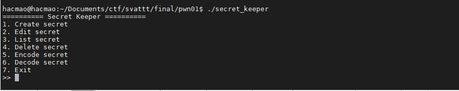  

Trông là đã thấy heap rồi. Challenge còn không cho libc luôn?

Chương trình có seccomp-tools, cho phép `mprotect`, `read`, `write`, `open`. Bài này phải đọc ghi file flag. Và không cho đường dẫn của `flag` luôn.  

  

Bài này có khá nhiều chức năng. Đầu tiên, hàm `create_secret` cho phép chúng ta tạo một struct `secret`. Trong hàm này lại có hai cách để tạo secret :  

+ Tạo mới :  

 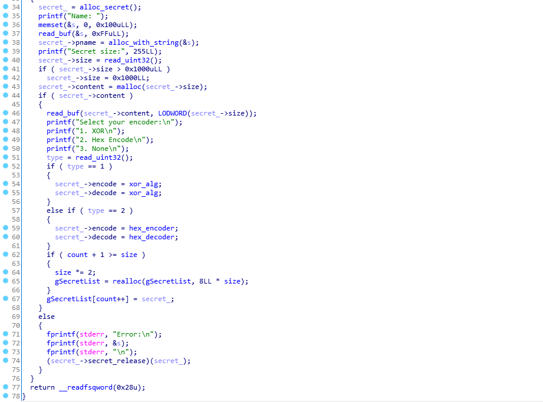  

 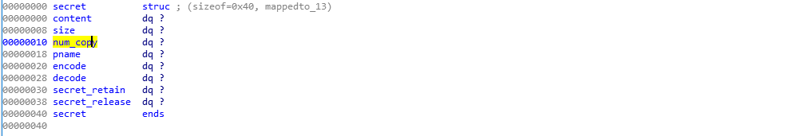  

 Cho phép chúng ta nhập nội dung, kích thước cấp size < 0x1000. Và chọn chế độ `enc`.  

+ Copy từ bản cũ :  

 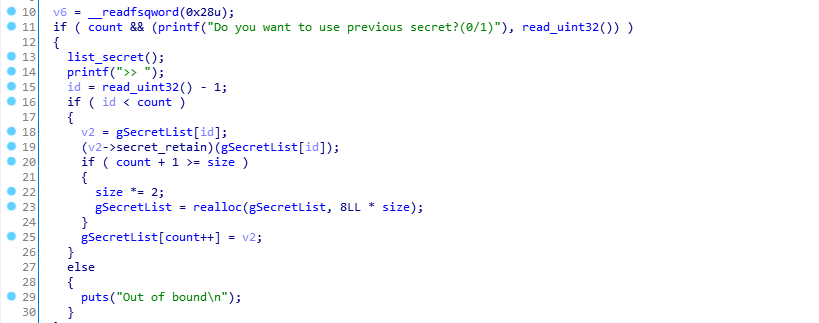  

 Copy y hệt luôn chỉ tăng số `num_copy` lên.  
 Hàm `secret_retain` làm nhiệm vụ tăng `num_copy`.  
 Nếu kích thước vùng nhớ hiện tại của `gSecretList` không đủ, nó sẽ cấp phát vùng nhớ mới.  

 Hàm `edit_secret` :  

 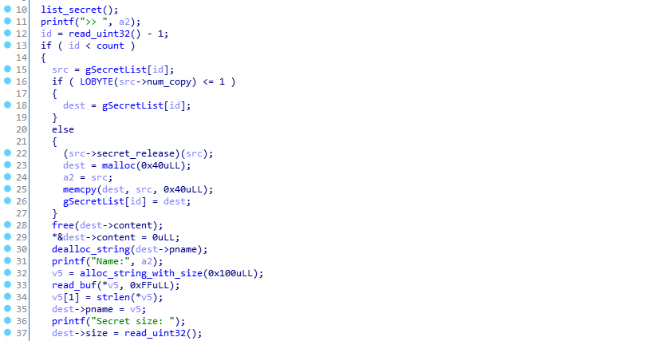  

 Hàm này thực hiện chức năng chỉnh sửa `secret`, tuy nhiên thay vì chỉnh sửa khó khăn và dễ gây lỗi, tác giả sửa bằng cách đập đi làm lại. Không có lỗi ở đây.  

+ Lỗi tạo `UAF` tại hàm `secret_release` :  

 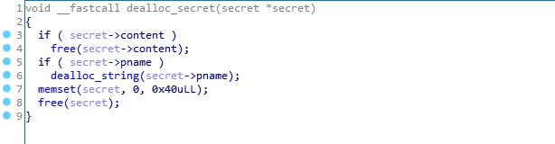  

 Nếu ta tạo hai bản copy, khi edit nó sẽ xóa 1 bản mà ta vẫn còn con trỏ tại bản copy thứ hai.  

 Chức năng `list_secret` cho phép chúng ta xem nội dung của `secret`.  

 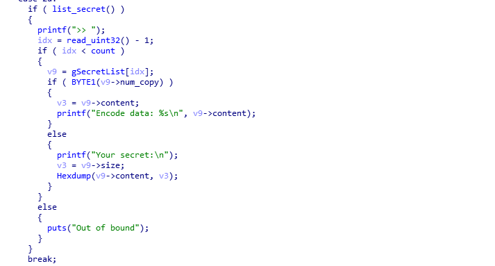  

 Chức năng `delete_secret` cho phép xóa 1 secret, mov con trỏ ra khỏi list. Không có lỗi.  

 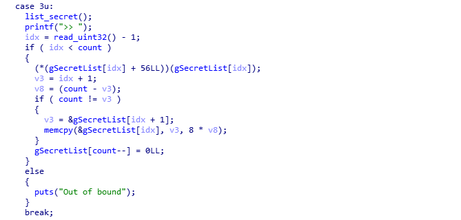  

 Hai cái `encode` vs `decode` khá phức tạp, mình không đọc kĩ lắm. Để dùng sau vậy.  

## UAF to Leak  

Viết các hàm cần thiết :  

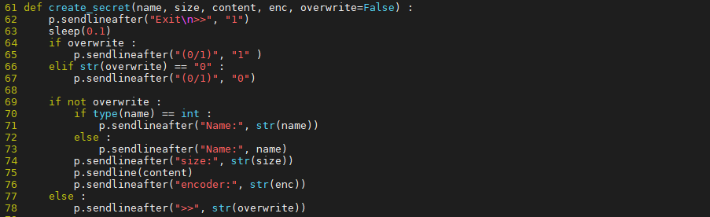  

Chúng ta sẽ tạo `secret 1` và bản copy của nó.  

Sau khi tiến hành `edit`, ta sẽ có UAF, dùng bản copy của nó để leak :  

```python
create_secret(1, 0x90, 'abc', 1)            # init chunk
create_secret(2, 0x30, 'abc', 1, 1)         # copy chunk
create_secret(3, 0x30, 'abc', 1, 0)         # <- top chunk for easy work
edit_secret(1, "abc", 0x30, 'abc', 1)
list_secret(2)
```

Để leak libc, ta sẽ cấp phát một vùng nhớ > 0x410 rồi làm tương tự như trên.  

Sau khi leak libc, mình attack lên server thấy cùng offset. Nên đoán là libc 2.31. May quá. 😀 Không chắc ngồi đoán mò lib mất.  

## UAF to Double free  

Double free cũng khá đơn giản. Chúng ta chỉ cần dùng lỗi UAF thôi.  

Tuy nhiên trên libc 2.31 có cơ chế detect được double free. Lúc này khi bị lỗi, chương trình ban đầu có seccomp rules sẽ chặn syscall, để cho dễ dàng thì mình pass bỏ seccomp luôn. Lưu ý điều này không nên làm vì nó gây ra sự xáo trộn cực lớn về các chunk trên heap. 😑  

Đoạn check detect dựa vào struct :  

```c
typedef struct tcache_entry
{
  struct tcache_entry *next;
  /* This field exists to detect double frees.  */
  struct tcache_perthread_struct *key;
} tcache_entry;
```

```c
void tcache_put(mchunkptr chunk, size_t tc_idx)
{
  tcache_entry *e = (tcache_entry *) chunk2mem (chunk);
  assert (tc_idx < TCACHE_MAX_BINS);
  /* Mark this chunk as "in the tcache" so the test in _int_free will
     detect a double free.  */
  e->key = tcache;
  e->next = tcache->entries[tc_idx];
  tcache->entries[tc_idx] = e;
  ++(tcache->counts[tc_idx]);
}
```

Thay vì để `BK` của `tcache` bị rỗng, thì nó sẽ nhét địa chỉ của `tcache` vào `BK`. Sau đó, khi tiến hành free một chunk vào tcache, nó sẽ check BK mà bằng `tcache` sẽ bị detect là `double free`.  

```c
if (__glibc_unlikely (e->key == tcache))
          {
            tcache_entry *tmp;
            LIBC_PROBE (memory_tcache_double_free, 2, e, tc_idx);
            for (tmp = tcache->entries[tc_idx];
                 tmp;
                 tmp = tmp->next)
              if (tmp == e)
                malloc_printerr ("free(): double free detected in tcache 2");
```

Chúng ta cần dùng lỗi `UAF` để ghi đè lên vùng này.  
Mình sử dụng hàm `encode` để ghi đè. Đồng thời, hàm `encode` cũng `free` luôn `content` :  

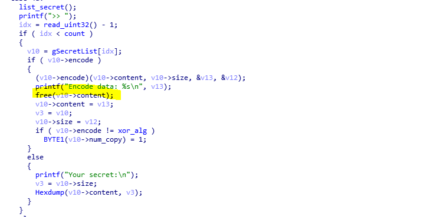  

Yeah và ta có double free. Lúc này thì thực hiện `tcache poinson` để ghi đè lên địa chỉ tùy ý.  

## Rop in the heap  

Do seccomp tools nên độ khó của bài này tăng lên khá là cao. Và đây chắc cũng là phần hay nhất của bài này. 😥  

Lúc đầu ý tưởng tiếp cận của mình là ghi đè lên `malloc_hook` địa chỉ của gadget `ret` để xem trên stack có cái gì mình có thể tận dụng không. Ý tưởng tương tự như các bài `heap - seccomp` khác  :v Nhưng ko, chả có gì trên stack . Chúng ta không được quyền input lên stack nên không thể đặt rop trên đây được. Vậy rop chỉ có thể trên heap.  

Tiếp đến, mình nhận ra có rất nhiều hàm mình có thể ghi khác như các con trỏ :  

+ `secret->encode`
+ `secret->decode`
+ `secret->release`
+ `secret->retain`  

Mình lại có ý tưởng biến các hàm `decode`, `encode` thành các function `open`, `read` tuy nhiên các tham số có vẻ không được đảm bảo.  

Tiếp đến, tiếp tục search trong libc có gadget nào để tác động tới esp hay không. Mình tìm được một gadget khá thú vị :  

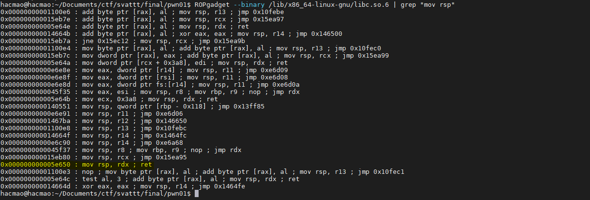

Với gadget này thì mình có thể thay đổi `rsp` bằng `rdx`. `rdx` thường là tham số thứ ba truyền vào của một hàm. Mà hàm `encode` lại có 3 tham số. `Perfect`.  

Tham số này được quyết định lại là con trỏ của stack. :))) Đời éo như mơ. Những thứ đẹp như này toàn là lừa cả đấy :vv  

Ta cần tham số của `rdx` là `heap` để `rop in the heap` cơ.  

Đảo qua các options còn lại thì không thấy có hàm nào là dùng tới 3 tham số khác cả. Nhưng magic thay hàm `secret->retain` tuy không dùng tham số thứ ba nhưng nó vẫn thay đổi `rdx` :)))  

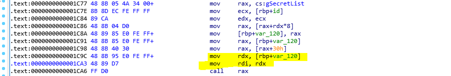  

Magic gì đây :))  

Như vậy ta đã có `rdx = heap_addr` rồi.  
Bùm và đây là đoạn mình đã làm tới trong lúc thi. Khá là sure kèo sẽ làm tiếp được. Tuy nhiên tại đây có một khó khăn nữa là địa chỉ truyền vào là heap nhưng mà lại là heap của các struct `secret` nên không thể rop được.  

Lúc thi mình nghĩ là cần tới 2 double free để thực hiện OOB write vừa ghi cả vào `secret->retain` của một chunk nào đó vừa ghi đè lên `gSecretList` cơ. Nên nản và biết là éo kịp thời gian.  

Về nhà bình tâm lại mới thấy thực ra không cần.  

Chúng ta chỉ cần ghi đè tạo một fake `gSecretList` là được. Sau đó, tạo một fake_secret có `fake_secret->retain = mov_rsp_rdx`.  

Fake_secret phải vừa đảm bảo nó là một secret hợp lệ có `pName` hợp lệ vừa phải có `retain` như trên. Ta có thể làm điều này nhờ các lệnh `pop`.  

Mình tạo một rop để cấp quyền `rwx` cho heap rồi chạy shellcode.  

```python
pop_rdi = libc.address + 0x26b72
pop_rcx = libc.address + 0x9f822
pop_rsi = libc.address + 0x27529
pop_rdx_rbx = libc.address + 0x162866
pop_rax = libc.address + 0x4a550
syscall = libc.address + 0x11bb04

shellcode = asm(
    shellcraft.pushstr( 'flag\x00' ) +
    shellcraft.open( 'rsp' , 0 , 0 ) +
    shellcraft.read( 'rax' , 'rsp' , 0x70 ) +
    shellcraft.write( 1 , 'rsp' , 0x70 )
)

fake_chunk = flat([
        pop_rdi, heap_base,  
        pop_rcx, heap_base + 0x3000,      # fake_name at heap + 0x3000
        pop_rdx_rbx, 0x7, mov_rsp_rdx,    # retain
        pop_rsi, 0x2000,
        syscall,                          # mov al, 0xa
        heap_base + 0x10d0                # shellcode  
    ])
```

Sau đó chỉ việc chạy và có flag thôi.  

  

Đúng như nguyện vọng đây là một bài rất hay, chỉ là mình không đủ khả năng để giải quyết nó thôi. GG.

## Kết  

Đây cũng là kì thi SVATTT cuối cùng của mình. Và bùm feed như chưa bao giờ được feed. Nhưng mình cũng học được nhiều điều.  

Gửi đến bản thân trong tương lai :  
`Cố gắng để không phải nuối tiếc`.  

10 năm sau nhìn lại không biết thời thế sẽ thay đổi như nào.  
